# Alpamayo-R1: 롱테일에서 일반화 가능한 자율주행을 위한 추론과 행동 예측의 연결

NVIDIA[^1]

[^1]: 자세한 기여자 목록과 감사의 글은 본 논문 App. A에 수록되어 있다.

© 2025 NVIDIA. All rights reserved.

## 초록

모방학습으로 학습된 end-to-end 아키텍처는 모델 규모와 데이터 규모를 확장함으로써 자율주행을 발전시켜 왔지만, 감독 신호가 희소하고 인과적 이해가 제한적인 안전 필수 롱테일 시나리오에서는 여전히 취약하다. 이를 해결하기 위해 우리는 복잡한 주행 시나리오에서 의사결정을 향상시키기 위해 Chain of Causation 추론과 궤적 계획을 통합하는 vision-language-action model(VLA)인 Alpamayo-R1(AR1)을 소개한다. 우리의 접근법은 세 가지 핵심 혁신을 특징으로 한다. (1) 하이브리드 자동 라벨링 및 human-in-the-loop 파이프라인을 통해 구축된 Chain of Causation(CoC) 데이터셋으로, 주행 행동과 정렬된 의사결정 기반의 인과적으로 연결된 추론 trace를 생성한다. (2) Physical AI 응용을 위해 사전학습된 Vision-Language Model인 Cosmos-Reason과, 실시간으로 동역학적으로 가능한 계획을 생성하는 diffusion 기반 궤적 디코더를 결합한 모듈형 VLA 아키텍처. (3) 추론을 유도하기 위한 supervised fine-tuning과, 대형 추론 모델 피드백을 통해 추론 품질을 최적화하고 추론-행동 일관성을 강제하기 위한 reinforcement learning(RL)을 사용하는 다단계 학습 전략. 평가 결과, AR1은 궤적 전용 baseline 대비 어려운 사례에서 planning accuracy를 최대 12% 개선하고, closed-loop 시뮬레이션에서 off-road rate를 35%, close encounter rate를 25% 줄였다. RL post-training은 대형 추론 모델 critic으로 측정한 추론 품질을 45%, reasoning-action consistency를 37% 개선했다. 모델 규모를 0.5B에서 7B parameters로 확장할 때 일관된 개선이 나타났다. 차량 실도로 테스트는 실시간 성능(99 ms latency)과 도시 환경 배포 성공을 확인했다. 해석 가능한 추론과 정밀 제어를 연결함으로써 AR1은 Level 4 자율주행을 향한 실용적 경로를 보여준다. 우리는 향후 업데이트에서 AR1 모델과 CoC의 일부를 공개할 계획이다.

## 1. 서론

자율주행 시스템의 발전은 전통적인 모듈형 아키텍처(Urmson et al., 2008; Paden et al., 2016; Zhang et al., 2018; Lefèvre et al., 2014)에서 end-to-end(E2E) 주행 프레임워크(Bojarski et al., 2016; Hu et al., 2023; Gu et al., 2023; Weng et al., 2024; Wu, 2025)로의 패러다임 전환을 목격해 왔으며, 이는 산업계에서도 점점 더 받아들여지고 있다. 인식, 예측, planning을 handcrafted 중간 표현으로 명시적으로 분리하는 모듈형 설계와 달리, E2E 접근법은 공동 학습되는 신경망을 통해 원시 센서 입력을 차량 움직임에 직접 매핑한다. 이러한 통합 공식화는 수작업으로 설계된 인터페이스를 제거하고, 대규모 공동 최적화와 데이터 기반 policy learning을 가능하게 한다. transformer 기반 아키텍처의 최근 발전과 대규모 주행 데이터셋은 E2E 주행 패러다임의 전반적 성능과 일반화를 더욱 향상시켰다. 이러한 성공에도 불구하고, 현재 E2E 접근법은 감독 신호가 희소하고 고수준 추론이 필요한 롱테일 및 안전 필수 상황을 처리하는 데 여전히 취약하다. 따라서 기존 E2E 모델의 역량과, 주행 특화 추론 능력을 갖춘 견고한 Level-4 autonomy 달성 요구사항 사이에는 여전히 큰 간극이 존재한다.

대형 언어 모델(LLMs)의 최근 발전(Achiam et al., 2023; Comanici et al., 2025)은 이러한 추론 격차를 해결할 유망한 방향을 제공한다. LLM은 인공지능을 변화시켰고, scaling laws(Kaplan et al., 2020)는 compute와 data가 증가함에 따라 모델 성능이 예측 가능하게 향상됨을 보여주었다. 학습 시점의 scaling을 넘어 OpenAI o1(OpenAI, 2024), DeepSeek-R1(DeepSeek-AI, 2025)과 같은 최신 frontier model은 새로운 패러다임인 inference-time reasoning을 도입했다. 전통적인 단일 단계 답변 생성과 달리, 이러한 모델은 인간의 문제 해결 전략을 모방하는 chains of thought(Wei et al., 2022)라 불리는 중간 추론 trace를 생성한다. 이 변화는 inference time을 조절 가능한 자원으로 만든다. 숙고적 추론에 더 많은 compute를 할당하면 더 정확하고 견고하며 검증 가능한 결정을 얻는 경우가 많다(Yao et al., 2023). 이 추론 능력은 의사결정이 본질적으로 불확실하고 안전 필수적인 자율주행에서 특히 중요하다. 텍스트 기반 추론은 모델이 행동을 확정하기 전에 언어 공간에서 대안적 결과를 탐색하게 하며, 다음과 같은 핵심 장점을 제공한다.

1. 명시적 counterfactual reasoning과 런타임 안전 cross-check 및 monitoring 가능성을 통한 안전성 향상
2. 사람이 읽을 수 있는 decision rationale을 통한 더 나은 해석 가능성
3. 롱테일 성능을 높이기 위한 검증 가능한 reward로 사용할 수 있는 더 풍부한 학습 신호

VLM/VLA는 자율주행에 널리 적용되어 왔지만(Mao et al., 2023, 2024; Hwang et al., 2024; Zhou et al., 2025; Renz et al., 2025), 대부분의 접근법은 명시적 추론이 부족하거나(Wu, 2025; Zhou et al., 2025; Jiang et al., 2025), 자유 형식의 비구조적 방식으로 추론을 수행한다(Luo et al., 2025; Yuan et al., 2025; Rowe et al., 2025). 이러한 접근법은 특히 강한 도메인 prior가 필수적인 모호하거나 조합적인 롱테일 시나리오에서 학습 분포를 넘어 일반화하는 데 어려움을 겪는다. 또한 autonomous vehicle(AV) reasoning을 순수 natural language processing(NLP) 문제로 다루면 lane geometry, traffic rules, map priors, agent interactions, dynamic constraints와 같은 주행에 내재한 풍부한 구조적 지식을 간과하게 된다.

우리는 자율주행을 위한 효과적인 추론은 인과적으로 grounding되어야 하고 주행 과제와 구조적으로 정렬되어야 한다고 주장한다. 장황하고 비구조적인 narrative를 생성하는 대신, reasoning trace는 관찰된 scene evidence를 구체적인 주행 결정에 causal chain으로 명시적으로 연결해야 하며, 이 결정은 low-level trajectory generation을 직접 condition하거나 control해야 한다. 위 설계 원칙은 추론이 단순히 해석 가능성을 높이는 부가물이 아니라, 학습 효율과 closed-loop 주행 성능을 모두 향상시키는 기능적 구성요소가 되도록 한다. 이는 특히 안전 필수 롱테일 이벤트에서 중요하다.

본 연구에서 우리는 vision-action(VA) model Alpamayo-VA(Wu, 2025)에 구조적 추론 능력을 확장하여, 일반화 가능한 자율주행을 위해 추론과 행동 예측을 연결하는 VLA인 Alpamayo-R1을 소개한다. 이 모델은 위에서 제기한 문제를 세 가지 핵심 혁신으로 해결한다.

1. 주행 시나리오와 정렬된 의사결정 기반의 인과적으로 연결된 reasoning trace를 생성하는 구조화된 Chain of Causation(CoC) 라벨링 프레임워크를 개발한다. 이는 확장 가능한 고품질 데이터 생성을 위한 하이브리드 human-in-the-loop 및 자동 라벨링 파이프라인으로 지원된다.
2. flow matching(Lipman et al., 2023; Driess et al., 2025)에 기반한 diffusion-based action-expert trajectory decoder를 사용하여, 실시간 inference 요구사항을 만족하면서 language reasoning output과 정렬된 연속적이고 multi-modal한 trajectory plan을 효율적으로 생성한다.
3. Cosmos-Reason VLM backbone 위에 action modality를 주입하여 trajectory prediction을 수행하고, CoC data에 대한 supervised fine-tuning으로 reasoning을 유도하며, reinforcement learning(RL)을 사용해 reasoning quality, reasoning-action consistency, trajectory quality를 향상시키는 다단계 학습 전략을 채택한다.

광범위한 open-loop 및 closed-loop(시뮬레이션 및 onboard) 평가를 통해, AR1은 end-to-end baseline 대비 상당한 개선을 달성하며, 가장 큰 이득은 드물고 안전 필수적인 시나리오에서 나타나고, 동시에 실시간 inference 성능(99ms end-to-end latency)을 유지함을 보인다.

이후 섹션에서는 프레임워크의 세부 구성요소를 제시한다. Sec. 2는 관련 연구를 검토한다. Sec. 3은 모델 아키텍처와 핵심 설계 선택을 제시한다. Sec. 4는 자율주행의 reasoning-based VLA task를 위해 특별히 개발된 하이브리드 라벨링 파이프라인과 CoC 데이터셋을 설명한다. Sec. 5는 AV 도메인에서 일반 visual-language understanding을 향상시키는 단계에서 action modality 생성, reasoning ability 및 output alignment 강화까지, 모델 역량을 점진적으로 높이는 다단계 학습 전략을 설명한다. 마지막으로 Sec. 6은 open-loop와 closed-loop 환경 모두에서 접근법의 효과를 입증하는 광범위한 평가 결과를 보고한다.

## 2. 관련 연구

우리 연구는 자율주행을 위한 VLM, reasoning-augmented action model, post-training alignment technique의 최근 발전 위에 구축된다. 우리는 네 가지 핵심 영역을 중심으로 관련 연구를 정리한다. 첫째, Sec. 2.1에서 자율주행 내 general-purpose VLM(Hwang et al., 2024; Xu et al., 2024)에서 action-oriented VLA(Zhou et al., 2025; Renz et al., 2025)로의 진화를 논의하며 embodied action prediction으로의 전환을 강조한다. 둘째, Sec. 2.2에서 해석 가능한 의사결정을 위해 명시적 chain-of-thought process(Wei et al., 2022; Luo et al., 2025; Rowe et al., 2025)를 통합하는 reasoning VLA를 검토한다. 셋째, Sec. 2.3에서 post-training alignment method, 특히 우리의 reasoning alignment 접근법의 기반이 되는 RL from human feedback(RLHF)(Christiano et al., 2017)와 RL with verifiable rewards(RLVR)(DeepSeek-AI, 2025)를 검토한다. 마지막으로 Sec. 2.4에서 자율주행의 vision-language dataset을 검토하고, 기존 reasoning dataset(Sima et al., 2024; Nie et al., 2024)의 주요 한계를 식별하여 우리의 데이터 구축 방법론의 동기를 제시한다.

### 2.1. 자율주행의 VLM과 VLA

초기 연구는 LLM의 일반 지식을 주행에 활용하는 방식을 탐색했다. Drive-GPT(Mao et al., 2023), Wolf(Li et al., 2025), AgentDriver(Mao et al., 2024)는 planning을 text generation 또는 language-based tool use로 다루어 경쟁력 있는 open-loop 성능을 달성했다. Cube-LLM(Cho et al., 2025), TOKEN(Tian et al., 2024), EMMA(Hwang et al., 2024)는 multimodal LLM을 multi-task scene understanding과 trajectory prediction으로 확장했다. VLM-AD(Xu et al., 2024)는 VLM을 training-time supervisor로 사용하고, ReAL-AD(Lu et al., 2025)는 hierarchical reasoning을 모델링하며, DiMA(Hegde et al., 2025)는 VLM 지식을 효율적인 LLM-free planner로 distill한다.

보완적인 연구 흐름은 language와 명시적 action representation을 결합해 VLA 모델을 만든다. OpenDriveVLA(Zhou et al., 2025)는 구조화된 vision-language token으로부터 trajectory waypoint를 autoregressive하게 생성한다. AutoVLA(Zhou et al., 2025)는 adaptive “think vs. act” control로 reasoning과 action을 통합한다. IRL-VLA(Jiang et al., 2025)는 safety-efficiency balance를 위해 inverse RL을 포함하고, CoReVLA(Fang et al., 2025)는 long-tail scenario를 목표로 하며, SimLingo(Renz et al., 2025)는 Bench2Drive(Jia et al., 2024)에서 state-of-the-art closed-loop 결과를 달성한다. 그러나 이러한 접근법은 대체로 명시적 추론 없이 reactive하게 동작하며, counterfactual reasoning이 필요한 모호하거나 장기 horizon scenario에서 학습 분포 밖으로 일반화하는 데 어려움을 겪는다.

### 2.2. 자율주행의 Reasoning VLA

chain-of-thought(CoT)(Wei et al., 2022)와 tree-of-thought(ToT)(Yao et al., 2023) 같은 명시적 추론 방법은 중간 reasoning trace가 복잡한 언어 과제의 성능을 크게 향상시킬 수 있음을 입증했다. 자율주행 영역에서 최근 많은 VLA 연구는 structured reasoning을 vision-to-action pipeline에 통합함으로써 이 통찰을 채택한다. 한 흐름은 reasoning의 adaptive 또는 efficient invocation에 초점을 둔다. 예를 들어 AdaThinkDrive(Luo et al., 2025)는 RL로 학습된 fast-and-slow thinking mechanism을 사용해 필요할 때만 CoT를 호출하여 성능을 유지하면서 inference overhead를 줄인다. AutoDrive-R2(Yuan et al., 2025)는 명시적 CoT 및 self-reflection dataset(nuScenesR2-6K)을 구축하고, physics-grounded reward와 함께 GRPO(Shao et al., 2024)를 활용해 물리적 feasible성을 보장하면서 reasoning-augmented trajectory를 refine한다.

다른 접근법은 다양한 reasoning strategy를 탐색한다. RIV-CoT(Corbière et al., 2025)는 retrieval로 CoT를 보강하고, FutureSightDrive(Zeng et al., 2025)는 spatio-temporal reasoning을 수행하며, CoT-Drive(Liao et al., 2025)는 reasoning을 lightweight model로 distill한다. ReCogDrive(Li et al., 2025), ReasonPlan(Liu et al., 2025), MTRDrive(Luo et al., 2025), Drive-R1(Li et al., 2025), AgentThink(Qian et al., 2025), DriveAgent(Hou et al., 2025), DSDrive(Liu et al., 2025)는 memory, tool invocation, multi-agent reasoning 또는 compression을 결합한다. 특히 Poutine(Rowe et al., 2025)은 2025 Waymo Vision-Based End-to-End Driving Challenge에서 1위를 차지하며, RL finetuning을 적용한 reasoning-enhanced VLA가 long-tail scenario에서 뛰어남을 보여주었다. 이 연구들은 reasoning이 interpretability, runtime cost, performance 사이의 trade-off를 가지면서도 주행 결정의 기능적 핵심으로 작동함을 보여준다. 그러나 기존 접근법 대부분은 명시적 causal grounding과 reasoning-action consistency가 부족한 free-form reasoning에 의존한다. 반대로 우리 연구는 reasoning을 구체적인 주행 결정에 연결하는 구조화된 CoC framework를 도입하고, post-training RL로 reasoning quality, reasoning-action consistency, trajectory safety를 동시에 최적화한다.

### 2.3. Post-training Alignment

LLM과 text-to-image generator 같은 생성 모델은 주로 next-token prediction과 같은 imitative objective로 학습된다. 이 objective는 Internet-scale data로부터 효율적 학습을 가능하게 하지만, 시연된 행동을 유발한 전문가의 내부 reward function을 최적화한다는 실제 학습 목표의 proxy일 뿐이다. 결과적으로 생성 모델은 end-user intent에서 벗어나거나, 경우에 따라 harmful text output(Mu et al., 2024), unsafe visual generation(Lee et al., 2023), hazardous robot motion(Lu et al., 2023)과 같은 safety-critical failure를 보일 수 있다. 이러한 misalignment를 완화하기 위해 post-training alignment, 특히 RLHF(Christiano et al., 2017)가 생성 모델을 인간 선호와 정렬하는 핵심 전략으로 부상했다. reasoning model의 경우 DeepSeek-R1(DeepSeek-AI, 2025)은 Group Relative Policy Optimization(GRPO)(Shao et al., 2024)을 사용해 intermediate token likelihood가 아니라 verifiable solution에 보상을 줌으로써 reasoning quality를 직접 향상시키며, OpenAI o1(OpenAI, 2024)도 outcome-based RL이 chain-of-thought(CoT) quality를 크게 향상시킴을 보인다. embodied AI 영역에서는 이러한 alignment technique이 VLA로 확장되어 자율주행(Tian and Goel, 2025)과 assistive robot(Tian et al., 2024; Zhang et al., 2025)을 포함한 다양한 embodiment에서 인간 의도를 더 잘 반영하는 action을 생성한다. 이러한 방법이 action outcome 향상에 집중하는 반면, 우리 연구는 보완적 차원, 즉 reasoning process 자체를 개선하고 모델의 내부 decision rationale이 safety-critical autonomous driving 맥락에서 인과적으로 일관되고 contextually grounded되도록 보장하는 문제를 다룬다.

### 2.4. 자율주행을 위한 Vision-Language Dataset

open-source nuScenes(Caesar et al., 2020) dataset을 기반으로 초기 연구(Qian et al., 2024; Wu et al., 2025; Tian et al., 2025)는 주로 object-centric perception task에 초점을 맞추어 VLM이 일반 perception knowledge를 획득하고 driving scene에서 object grounding을 개선하도록 했다. nuScenes를 넘어 WOMD-reasoning(Li et al., 2024) 및 DriveQA(Wei et al., 2025) 같은 데이터셋은 vision-language annotation을 Waymo Open Motion Dataset(Ettinger et al., 2021) 및 CARLA simulator(Dosovitskiy et al., 2017) 같은 대규모 motion dataset으로 확장하며, agent interaction, traffic rules, right of way principle 설명에 초점을 둔다. 이 데이터셋들은 VLM pre-training을 위한 귀중한 자원이지만, language annotation이 ego vehicle의 action과 명시적으로 연결되어 있지 않다. 따라서 VLA에 필요한 핵심 능력인 planning-oriented reasoning에 대한 supervision은 제한적이다. 이 간극을 메우기 위해 기존 연구는 motion planning에 맞춘 language dataset 구축에 초점을 두었다. 예를 들어 Drama(Malla et al., 2023)는 ego vehicle behavior에 영향을 줄 수 있는 important object를 annotate한다. 이후 DriveAction(Hao et al., 2025)과 DriveBench(Xie et al., 2025)는 VLA training을 위한 comprehensive QA pair를 개발하며, planning에 중요한 object 식별뿐 아니라 motion prediction, traffic sign, road marking, navigation following 등을 위한 QA pair도 포함한다.

reasoning VLA의 발전에 동기를 받아 최근 연구는 일반 VLA dataset에서 ego vehicle action에 대한 명시적 설명을 제공하는 reasoning-oriented dataset으로 이동했다. 초기 시도로 BDD-X(Kim et al., 2018)는 driver behavior를 설명하는 소규모 human-written explanation을 제공한다. LLM/VLM의 큰 발전과 함께 DriveGPT4(Xu et al., 2024), CoVLA(Arai et al., 2025), LingoQA(Marcu et al., 2024)는 reasoning data의 언어적 표현력을 풍부하게 하기 위한 자동 또는 human-in-the-loop pipeline을 도입했다. perception, prediction, planning 전반의 전체 reasoning process를 포착하기 위해 DriveCoT(Wang et al., 2024), Nuinstruct(Ding et al., 2024), Reason2drive(Nie et al., 2024), DriveLM(Sima et al., 2024), Drivelmm-o1(Ishaq et al., 2025), Senna(Jiang et al., 2024)는 data construction을 위한 명시적 chain-based reasoning pipeline을 개발했다. 동시에 Impromptu VLA(Chi et al., 2025)는 unstructured road scenario에서 reasoning data를 curate하는 데 초점을 둔다. 그러나 이러한 데이터셋은 reasoning trace에서 observation과 action 사이의 causal relationship을 강제하는 데 여전히 핵심 한계를 보인다. 예를 들어 free-form reasoning trace는 trajectory와 상관된 actionable driving decision을 특정하는 대신 “ego vehicle should be cautious and watch out for ...” 같은 모호한 표현을 사용하는 경향이 있다. 또한 많은 reasoning trace는 “sunny weather”, “wide roads”, “... due to traffic rules” 같은 피상적 causal factor를 포함하거나, labeling process에서 전체 video clip을 노출하고 관찰 불가능한 future event를 언급하여 causal confusion을 유발한다. 이러한 문제는 명시적이고, decision-grounded이며, causally linked된 reasoning trace를 갖춘 dataset의 필요성을 강조하며, 이것이 우리가 제안하는 CoC data pipeline의 동기다.

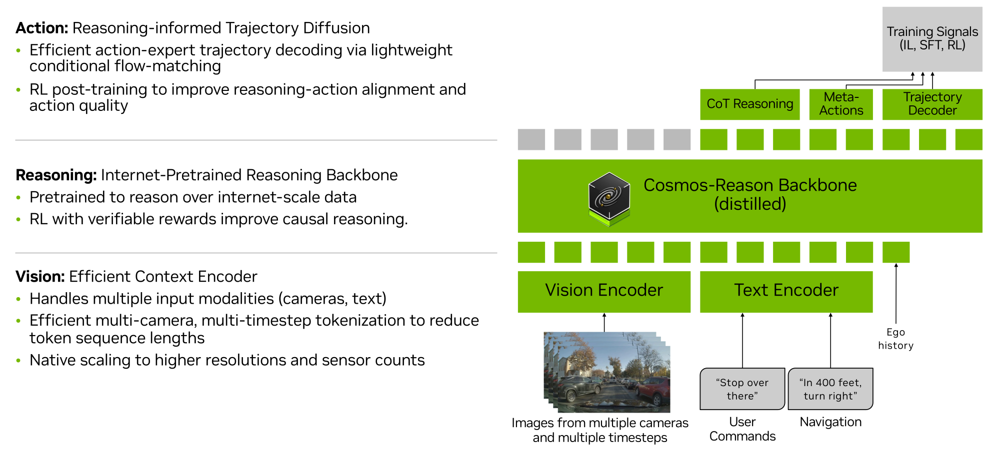

**Figure 1:** Alpamayo-R1 architecture의 개요. Multi-camera image와 egomotion은 vision encoder로 처리되어 visual token을 생성하고, 이는 textual input과 함께 VLM backbone(Cosmos-Reason)에 입력된다. 모델은 chain-of-thought reasoning과 discrete trajectory token을 autoregressive하게 생성한다. inference 시에는 flow matching을 사용하는 action-expert decoder가 reasoning output에 condition된 discrete trajectory token을 연속적이고 kinematically feasible한 waypoint로 변환한다.

## 3. Reasoning VLA Architecture 구축

자율주행을 위한 효과적이고 reasoning-capable한 VLA를 구축하려면, 현재 general-purpose VLM(Achiam et al., 2023; Comanici et al., 2025)이 제공하는 것을 넘어서는 여러 새로운 능력이 필요하다. 첫째, autonomous vehicle은 360도 situational awareness를 달성하기 위해 multi-camera, multi-timestep observation에 의존하지만, 표준 VLM은 보통 image나 video frame을 explicit temporal 또는 cross-view reasoning 없이 독립적으로 처리한다. 이로 인해 multi-camera input 처리 시 token 수가 지나치게 많아져 real-time inference가 불가능해진다. 둘째, 주행 결정은 free-form narrative가 아니라 causally structured reasoning(Wei et al., 2022)에 grounding되어야 한다. 모델은 history window 내에서 관찰 가능한 evidence에 기반해 어떤 maneuver가 안전하고 합법적인지 설명해야 한다. 셋째, 모델은 정밀하고 multi-modal한 trajectory prediction을 실시간으로 생성해야 한다. waypoint를 text token으로 autoregressive하게 decoding하는 것은 비효율적이고, 안전한 차량 제어에 필수적인 geometric 및 kinematic constraint가 부족하다(Driess et al., 2025). 마지막으로 long-tail scenario에서 safety를 보장하려면 reasoning trace가 executed action과 정렬되어야 한다.

이러한 과제를 해결하기 위해 우리는 Alpamayo-VA(Wu, 2025)를 확장하여 autonomous driving을 위한 reasoning과 action prediction을 통합하는 모듈형 VLA architecture인 Alpamayo-R1(AR1)을 소개한다. 우리의 설계 철학은 flexibility와 modularity를 강조한다. 이 architecture는 efficient vision encoding과 real-time action decoding을 위한 domain-specific component를 통합하면서, 임의의 off-the-shelf VLM backbone을 채택할 수 있다. 이 modularity는 vision-language pretraining(NVIDIA et al., 2025; Bai et al., 2025)의 발전을 활용하면서도, autonomous driving에서 high-level reasoning과 low-level control을 효율적으로 연결할 수 있게 한다.

**문제 공식화.** timestamp `T`까지의 과거 observation sequence `o`(아래에서는 생략)를 고려한다. 여기에는 multi-camera image `o_image`와 egomotion history `o_egomotion`이 포함된다. AR1은 Reason으로 표기되는 reasoning을 수행하고 ego vehicle의 future trajectory `τ`를 예측하도록 학습된다. 우리는 이 과제를 sequential prediction problem으로 공식화하며, 전체 sequence는 다음과 같이 구성된다.

```text
[o_image, o_egomotion, Reason, τ]                                      (1)
```

각 구성요소는 이전 모든 구성요소에 condition된다. 기본적으로 모델은 6초 길이의 future trajectory sequence 전체를 예측하도록 학습된다.

```text
τ = {(x_i, y_i, θ_i^yaw)}_{i=1}^{64}                                    (2)
```

여기서 `(x_i, y_i, θ_i^yaw)`는 time `T`에서 ego-vehicle coordinate frame 기준으로 10 Hz로 sampling된 `i`번째 future waypoint를 나타낸다. Sec. 3.2.2에서 자세히 설명하듯, 우리는 unicycle dynamics를 사용한 control-based representation을 채택하며 control input은 다음과 같다.

```text
a = {(a_i, κ_i)}_{i=1}^{64}                                             (3)
```

여기서 `a_i`와 `κ_i`는 각각 timestep `i`에서 acceleration과 curvature를 나타낸다. `τ`가 encoding 및 decoding되는 방법의 세부 사항은 Sec. 3.2.2와 Sec. 5.1에 제공된다.

**전체 아키텍처.** Fig. 1은 AR1의 end-to-end architecture를 제시한다. 시스템은 multi-camera, multi-timestep observation을 visual input으로 처리하며, 선택적으로 user command와 high-level navigation instruction 같은 textual input으로 보강한다. historical ego-motion data를 포함한 모든 input은 미리 정의된 순서에 따라 unified multimodal token sequence로 tokenization된다. 이 token들은 Cosmos-Reason(NVIDIA et al., 2025) backbone으로 처리되며, backbone은 reasoning trace, meta-action, predicted future trajectory를 나타내는 output token을 생성한다. 모델은 Sec. 5에서 설명할 supervised fine-tuning(SFT)과 RL을 결합한 여러 단계로 학습된다.

### 3.1. VLM Backbone: Cosmos-Reason

우리는 Alpamayo-R1의 VLM backbone으로 Cosmos-Reason(NVIDIA et al., 2025)을 채택한다. Cosmos-Reason은 Physical AI application을 위해 특별히 설계된 VLM으로, physical common sense와 embodied reasoning capability를 개발하기 위해 3.7M Visual Question Answering(VQA) sample로 post-trained되었다. 이 모델은 scene description, driving difficulty annotation, next action 예측을 위해 DeepSeek-R1(DeepSeek-AI, 2025)에서 distill된 reasoning trace를 포함하는 driving scenario 중심의 24.7K curated video VQA sample을 포함한다.

**Domain-Specific Supervised Fine-Tuning.** Cosmos-Reason을 autonomous driving deployment에 맞게 더 향상시키기 위해, 우리는 autonomous driving, robotics, healthcare, smart cities, manufacturing, retail, logistics 등 여러 Physical AI domain에 걸친 supplementary dataset을 curate한다. 이러한 광범위한 Physical AI pre-training은 모델이 driving scenario로 transfer되는 일반 physical common sense와 embodied reasoning capability를 개발하게 한다. autonomous driving에 대해서는 environment 내 critical object annotation과 next action reasoning을 포함하는 100K new sample로 training data를 보강한다.

**Driving-Focused Data Curation.** 우리는 autonomous driving을 위해 quality와 scale의 균형을 맞추는 보완적 labeling approach를 개발한다.

- Human-labeled data는 operational design domain(weather, lighting, road conditions), traffic regulations(traffic lights, signs), ego behaviors(interactive 및 non-interactive meta-actions), ego behavior에 영향을 미치는 critical object, observed maneuver 뒤의 causal reasoning을 포괄하는 annotation을 포함한다. 이러한 label은 복잡한 driving scenario에서 모델의 understanding과 reasoning을 개선한다.
- Automatically labeled data는 ego behavior reasoning과 prediction에 초점을 두며, longitudinal, lateral, lane-related meta-action 및 velocity information을 encoding한 driving-specific prior로 teacher VLM(예: Qwen3-VL(Qwen Team, 2025))을 prompting하여 생성된다. 이 scalable approach는 모델의 predictive reasoning capability를 강화한다.

### 3.2. Domain-Specific Adaptations

Cosmos-Reason은 강력한 기반을 제공하지만 real-world autonomous driving deployment에는 두 가지 critical gap이 남아 있다. multi-camera, multi-timestep input을 위한 efficient vision encoding과 real-time control을 위한 precise trajectory decoding이다. 다음 subsection은 이 과제를 해결하는 domain-specific component를 설명한다.

#### 3.2.1. Vision Encoding

VLM 내 vision encoder의 주된 역할은 input image를 LLM backbone의 후속 처리를 위한 token stream으로 변환하는 것이다. 그러나 VLA가 onboard deployment를 목표로 하므로, vision encoder의 핵심 요구사항은 environment의 relevant semantic information을 보존하면서 가능한 적은 token을 생성하는 것이다. 이를 위해 inference step당 얼마나 많은 정보가 encoding되는지, 즉 몇 장의 image가 몇 개의 token으로 압축되는지와 관련 architectural choice가 서로 다른 다양한 vision tokenization approach가 제안되어 왔다.

이 섹션에서는 AR1이 사용할 수 있는 여러 vision encoder와 그 trade-off를 논의하고, 더 큰 backbone size에서 real-time onboard inference를 가능하게 하기 위한 추가 token count compression 방향을 다룬다.

**Single-Image Tokenization.** 많은 vision tokenizer는 주로 single image representation에 초점을 맞추며, autoencoding architecture(Sohn et al., 2015; van den Oord et al., 2017; Esser et al., 2021)를 사용하거나 pixel patch를 직접 encoding한다(Dosovitskiy et al., 2020). VLM은 주로 후자를 채택하며, Vision Transformer(ViT)(Dosovitskiy et al., 2020)를 사용해 image를 patch로 분할하고 이를 encoding하여 1D token sequence를 만든다. 우리는 이 paradigm을 single-image tokenization이라 부르며, model이 각 input frame을 token set으로 encoding하는 방식이다.

AR1의 default tokenizer, 그리고 이후 모든 실험에 사용된 tokenizer는 이 paradigm을 활용한다. base VLM의 vision encoder(예: Zhai et al. (2023); Tschannen et al. (2025))를 사용해 `W × H px` input image를 patch feature `f ∈ R^{W/14×H/14×D}`로 encoding하고, 이를 2× bilinear downsampling하여 image당 `f' ∈ R^{W/28×H/28×D}` feature로 만든다. 예를 들어 `W = 448`, `H = 280`이면 이 과정은 image당 160 token을 생성한다.

**Multi-Camera Tokenization.** Single-image tokenization은 구현이 단순하지만, token count가 image resolution 및 camera 수에 선형적으로 증가한다(Wang et al., 2025). 주변 360도 view를 얻기 위해 AV는 흔히 6~10대 camera를 사용하며, patch-based tokenization은 timestep당 수천 개의 token을 만들어 real-time inference를 방해한다. 따라서 AR1은 여러 camera image를 intermediate representation으로 encoding한 뒤 그 representation을 tokenization하는 새로운 efficient multi-camera tokenizer 계열도 지원한다.

구체적으로 AR1은 Ivanovic et al. (2025)이 제안한 efficient multi-camera tokenizer도 사용할 수 있다. 이 tokenizer는 triplane을 3D inductive bias로 활용하여 여러 camera image를 동시에 효율적으로 표현한다. 중요한 점은 triplane size가 고정되어 있기 때문에 input camera 수와 resolution이 결과 token 수에서 decoupled된다는 것이다. grid size가 `S_x, S_y, S_z`이고 downstream patchification 값이 `p_x, p_y, p_z`인 triplane에서 tokenizer가 생성하는 token 수는 다음과 같다.

```text
((S_x - p_x)/p_x + 1)((S_y - p_y)/p_y + 1)
+ ((S_x - p_x)/p_x + 1)((S_z - p_z)/p_z + 1)
+ ((S_y - p_y)/p_y + 1)((S_z - p_z)/p_z + 1)                         (4)
```

첫 항은 `xy` plane의 patch 수, 두 번째 항은 `xz` plane의 patch 수, 세 번째 항은 `yz` plane의 patch 수를 나타낸다. 예를 들어 `S_x = S_y = 96`, `S_z = 48`, `p_x = p_y = p_z = 8`이면 camera 수나 resolution과 무관하게 observation 한 timestep을 표현하는 데 288 token만 필요하다. 7-camera vehicle setup에서는 image당 약 41.1 token에 해당하며, single-image tokenization보다 3.9× 적다. 또한 Sec. 6.6에서 보이듯, 이 효율성은 end-to-end driving metric에 큰 손실 없이 달성된다.

**Multi-Camera Video Tokenization.** 위 방식만으로도 sensor observation 표현에 필요한 token 수가 크게 줄어들지만, 추가 효율성을 얻을 수 있는 두 가지 근본 영역이 남아 있다.

1. temporal information 고려, 예를 들어 frame 간 정보 중복
2. structured feature representation 사용에서 오는 잠재적 performance ceiling 제거

따라서 AR1은 여러 timestep의 camera observation sequence 전체를 직접 encoding하는 multi-camera video tokenizer도 지원한다. 한 예는 Flex(Yang et al., 2025)로, full self-attention layer와 fixed query vector set을 통해 여러 camera와 timestep의 image token set을 압축하며, information bottleneck의 크기를 명시적으로 제어하는 mechanism을 제공한다. Sec. 6.6에서 보이듯, 이 접근법은 single-image tokenization 대비 최대 20× token compression rate를 달성하면서 downstream driving metric을 유지하거나 개선할 수 있다.

**Token Compression을 위한 추가 방향.** 위 tokenization strategy 외에도 여러 보완적 접근법이 token count를 더 줄일 수 있다. SparseVILA(Khaki et al., 2025)로 대표되는 post-training token pruning technique은 retraining 없이 inference 중 redundant token을 동적으로 식별하고 제거하여, 이미 학습된 모델의 computational cost를 줄이는 실용적 경로를 제공한다. 이러한 방법은 real-time performance constraint를 유지하면서 AR1을 더 큰 backbone으로 확장하기 위한 유망한 방향이다.

#### 3.2.2. Trajectory Decoding

VLM이 physical world에서 효과적으로 작동하도록 확장하려면, autonomous driving context에서 future driving trajectory에 해당하는 physical action을 VLA 학습에 포함하는 것이 필수적이다. 그러나 embodiment는 action decoding에 고유한 과제를 도입한다.

1. action representation은 fidelity와 multi-modality를 모두 보존할 만큼 정확해야 한다.
2. decoding process는 real-time inference를 지원할 만큼 충분히 빨라야 한다.
3. decoding mechanism은 VLA training pipeline에 매끄럽게 통합되어야 한다.

초기에 우리는 raw position, 즉 `(x, y)` waypoint space에서 모델을 학습하면 sensor noise에 취약하고 model convergence가 저하되는 경우가 많음을 발견했다. 또한 downstream low-level vehicle controller는 일반적으로 vehicle에서 일관되고 안정적인 실행을 보장하기 위해 trajectory output을 smooth한다. 따라서 raw position waypoint space에서 `τ`를 직접 학습하는 대신, 우리는 closed-loop performance를 개선하는 unicycle dynamics 기반 action representation을 채택한다. 구체적으로 control input `a = {(a_i, κ_i)}_{i=1}^{64}`를 사용하는 다음 unicycle dynamics(Lynch and Park, 2017)를 사용하고 Euler discretization을 적용한다.

```text
x_{i+1} =
[
  x_i + ΔT/2 (v_i cos θ_i + v_{i+1} cos θ_{i+1}),
  y_i + ΔT/2 (v_i sin θ_i + v_{i+1} sin θ_{i+1}),
  θ_i + ΔT κ_i v_i + (ΔT^2 / 2) κ_i a_i,
  v_i + ΔT a_i
]                                                                  (5)
```

우리 설정에서 `ΔT = 0.1s`이고, `x`와 `y`는 bird’s-eye-view(BEV) plane의 positional waypoint, `θ`는 yaw angle, `v`는 velocity, `κ`는 curvature, `a`는 acceleration을 나타낸다. 학습 중에는 high-frequency noise를 attenuate하기 위해 Tikhonov regularization을 사용하는 least-squares formulation을 통해 ground-truth control sequence `a`를 `τ`에서 도출한다. 모델은 control sequence `a`를 예측하도록 학습되며, inference 중에는 Eq. (5)를 적용해 이를 `τ`로 mapping한다.

또한 AR1이 trajectory를 이해하고 생성할 수 있도록 `τ`를 discrete token 또는 continuous embedding으로 encoding한다. discrete representation에서는 `a`의 각 continuous value를 predefined range 내에서 균일하게 quantize하여 equally spaced bin으로 나누고, 결과 index를 special token으로 표현한다. continuous representation에서는 sinusoidal positional encoding과 MLP projection을 통해 `a`를 AR1 embedding space로 mapping한다. 구체적으로 우리는 `π0.5-KI`(Driess et al., 2025)에서 영감을 받은 전략을 채택하여, VLM 내에서 학습되는 discrete trajectory token과 flow matching framework(Lipman et al., 2023)를 사용해 동일 trajectory를 continuous representation으로 decoding하는 action-expert를 결합한다. 이 framework는 streamlined VLM training을 촉진하고, trajectory decoding을 가속하며, 더 나은 closed-loop performance를 달성한다. action modality injection의 학습 세부 사항은 Sec. 5.1에 제공된다.

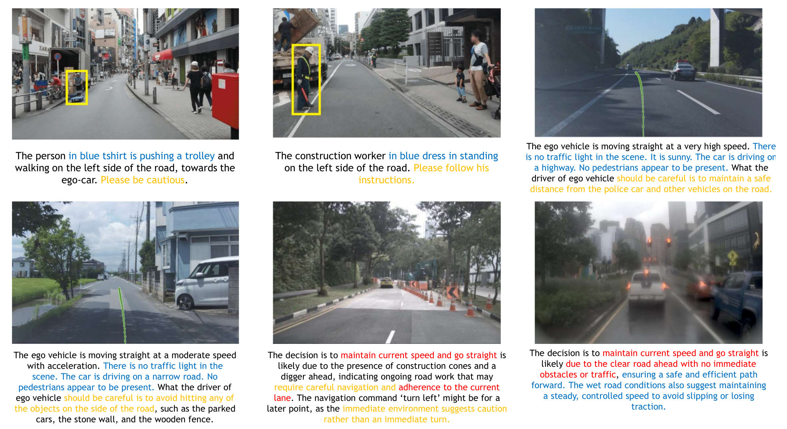

**Figure 2:** 기존 데이터셋(Malla et al., 2023; Chi et al., 2025; Arai et al., 2025)의 reasoning trace에서 나타나는 일반적 문제 예시. 노란색으로 강조된 텍스트는 trajectory와 상관된 구체적 driving decision을 특정하지 못하는 모호한 behavior description을 나타낸다. 파란색은 ego vehicle의 decision에 직접 정보를 제공하지 않는 contextual observation 같은 superficial reasoning을 나타낸다. 빨간색은 ego vehicle의 실제 behavior와 모순되는 incorrect 또는 causally inconsistent reasoning을 나타낸다.

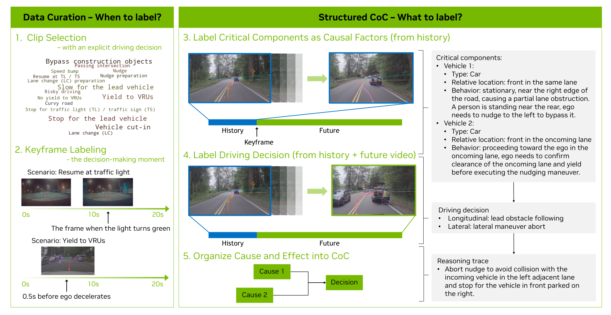

**Figure 3:** 제안하는 structured CoC labeling pipeline의 개요. 다섯 단계로 구성된다. (1) Clip Selection: explicit driving decision을 포함하는 clip을 선택하여 causal information이 제한적인 low-signal clip을 걸러낸다. (2) Keyframe Labeling: 각 video clip 내 decision-making moment를 식별하여 potential causal confusion을 최소화한다. (3-5) Structured CoC Labeling: 최종 CoC를 구성하고 causal confusion을 더 줄이기 위해 future frame의 causal factor를 참조하지 않으면서 observation에서 critical component를 먼저 annotate하고, 그에 대응하는 driving decision을 label한다. 그런 다음 driving decision과 causal factor를 natural language로 reasoning trace로 구성한다.

**요약.** 이 섹션은 VLM이 AV policy VLA로 체계적으로 적응되는 두 주요 설계 차원, vision encoding과 action decoding을 자세히 설명했다. 이후 섹션에서는 data pipeline 구축과 training strategy formulation을 설명하며, 이는 함께 모델에 enhanced reasoning 및 alignment capability를 부여하여 long-tail event 처리의 robustness를 개선한다.

## 4. Chain of Causation Dataset: 인과적으로 Grounded된 Reasoning VLA 학습

reasoning VLA model이 driving action의 원인을 설명하고 trajectory-level performance를 개선하게 하려면, reasoning data가 ego trajectory와 밀접하게 상관되어야 한다. 그러나 AV community의 기존 CoT reasoning dataset은 Fig. 2와 같이 여러 한계를 보인다.

1. 모호한 behavior description: free-form CoT annotation은 구체적인 driving action을 특정하지 못하거나 ego trajectory와 약하게만 상관된 단어를 선택할 수 있다.
2. 피상적 reasoning: 일부 reasoning trace는 ego vehicle behavior와 직접 causal link가 없는 contextual observation 또는 hypothetical factor를 주로 설명하여 post-training driving performance 개선에 제한적 이득만 제공한다.
3. causal confusion: reasoning trace는 모델이 training 중 관찰할 수 없는 future time window의 causal factor를 포함할 수 있다. 이는 labeling process가 historical segment와 future segment를 구분하지 않고 전체 video를 노출하는 경우가 많기 때문에 발생한다.

이 간극을 해결하기 위해 우리는 reasoning trace에 explicit causal structure를 강제하는 labeling framework를 도입한다. 먼저 low-level ego trajectory에 직접 대응하는 comprehensive high-level driving decision set을 정의한다. 각 reasoning trace는 explicit driving decision과 연결되며, 그 driving decision을 유발하는 causal factor만 포함한다. historical video segment와 future video segment를 나누는 keyframe을 신중히 선택함으로써 모든 causal factor가 observable history window에서 나오도록 보장하고, causal confusion을 방지한다. 이 설계는 모든 reasoning trace가 decision-grounded이면서 causally linked되도록 하여, 장황한 descriptive narrative가 아니라 간결하고 해석 가능한 cause-and-effect relationship을 포착한다. 결과 데이터셋은 Chain of Causation(CoC) dataset이라 부르며, decision causality 학습을 위한 명확한 supervision을 제공하여 reasoning VLA가 onboard inference 중 특정 driving action의 원인을 효율적으로 reason할 수 있게 한다. labeling pipeline 개요는 Fig. 3에 제시되어 있다.

### 4.1. Structured Chain of Causation

효율적인 annotation을 위해 우리의 labeling framework는 각 data sample을 세 가지 structured component, 즉 driving decision, causal factors(critical components), composed CoC trace로 분해한다. 따라서 각 data instance는 이 세 component를 포함하는 structured CoC sample을 구성한다.

**Table 1:** reasoning trace를 explicit control intent에 anchor하기 위해 사용하는 closed-set driving decision(longitudinal 및 lateral). Annotator는 channel당 최대 하나의 decision 또는 None을 선택하여 decision-grounded supervision을 보장한다. 정의는 operational intent를 강조하고 Lead obstacle following과 Yield, Lane change와 Merge / Split처럼 시각적 또는 행동적으로 유사한 maneuver를 구분한다. 선택된 각 decision은 observed history window의 evidence에 의해 causally supported되어야 한다. LC는 lane change를 의미한다.

| Type | Driving decision | Definition |
| --- | --- | --- |
| Longitudinal | Set speed tracking | unconstrained일 때 target speed를 유지하거나 도달한다. follow/yield/stop logic은 제외한다. |
| Longitudinal | Lead obstacle following | lead entity(같은 traffic flow에서 가장 가까운 in-path entity)에 대해 안전한 time gap을 유지한다. geometry-based slowing, gap-matching, non-lead entity에 대한 yielding은 제외한다. |
| Longitudinal | Speed adaptation (road events) | curve, grade, bump, ramp, roundabout, turn 같은 roadway feature에 맞춰 speed를 조정한다. lead와 독립적이다. |
| Longitudinal | Gap-searching (for LC/merge/zipper) | planned lateral maneuver를 지원하기 위해 target stream에 speed를 맞추거나 usable gap을 만든다. |
| Longitudinal | Acceleration for passing/overtaking | associated lateral plan과 함께 더 느린 lead를 지나가기 위해 speed를 증가시킨다. |
| Longitudinal | Yield (agent right-of-way) | pedestrian, cross-traffic, emergency vehicle, cut-in 같은 특정 agent에게 priority를 양보하기 위해 slow/stop한다. |
| Longitudinal | Stop for static constraints | stop/yield line, red light, school bus/rail rule 같은 control point에서 decelerate하고 hold한다. 충돌을 피하기 위해 right-of-way를 가진 경우에도 yield가 필요할 수 있다. |
| Lateral | Lane keeping & centering | lane boundary 내 position을 유지한다. minor in-lane offset은 허용되지만 lane line을 넘지 않는다. |
| Lateral | Merge / Split (facility change) | on-ramp ↔ mainline, weave segment 등 facility 간 전환을 수행한다. 같은 road의 lane change가 아니다. |
| Lateral | Out-of-lane nudge (straddle avoidance) | blockage/hazard 주변 clearance를 늘리기 위해 의도적으로 짧게 lane-line을 cross하고 원래 lane으로 돌아온다. left/right를 지정한다. |
| Lateral | In-lane nudge | lane line crossing 없이 blockage/hazard 주변 clearance를 늘리기 위해 lane 내부에서 temporary offset을 만든다. left/right를 지정한다. |
| Lateral | Lane change (lateral push) | gap negotiation을 수반하는 adjacent-lane full transition이다. reasoning trace에서 left/right를 지정한다. |
| Lateral | Pull-over / curb approach | pickup, emergency stop, parking approach 같은 edge/shoulder 또는 designated stop area로 이동한다. |
| Lateral | Turn (intersection/roundabout/U-turn) | significant heading change를 동반하여 다른 road segment로 planned path를 진행한다. left/right를 지정한다. |
| Lateral | Lateral maneuver abort | nudge, lane change, merge/split, pull-over 같은 ongoing lateral maneuver를 취소하고 안전할 때 re-center한다. |

**Driving Decision.** CoC data가 decision-grounded되도록 하기 위해 우리는 Tab. 1과 같은 high-level driving decision의 closed set을 정의한다. 각 clip은 critical reasoning moment 직후 ego vehicle이 수행하는 첫 action에 대응하여, longitudinal decision과 lateral decision을 각각 최대 하나씩 또는 None으로 annotate한다. 이 standardized inventory는 low-level trajectory와 직접 정렬되고 driving behavior에 대한 free-form하고 모호한 description을 제거하여, 모든 reasoning trace가 어떤 decision이 취해지는지 모호함 없이 특정하도록 보장한다. 언어적 일관성과 다양성을 위해 최종 CoC reasoning trace는 이러한 driving decision과 정렬된 compact verb set을 사용해 구성된다.

**Table 2:** driving decision의 causal factor가 될 수 있는 critical component의 category와 example attribute. driving decision에 직접 영향을 주는 것만 label한다. object behavior를 forecast하거나 signal이 부분적으로 occluded된 경우 Low/High uncertainty tag를 사용한다. 목록은 open-ended이며 필요에 따라 추가 critical component를 더할 수 있다.

| Category | Example attributes to record (if decision-relevant) | Uncertainty |
| --- | --- | --- |
| Critical objects | Type(veh./ped./cyclist/VRU), ego와의 relative pose(in-path, left/right, oncoming, crosswalk), motion(stopped, slowing, crossing, cut-in risk) | Low / High |
| Traffic lights | Current state(R/Y/G), arrow state, visibility/occlusion, wait line 존재 | - |
| Yield/Stop control | sign 존재, all-way vs two-way, stop/yield line location | - |
| Road events | curvature/grade, speed bump, narrowing, roundabout, ramp/junction ahead | - |
| Lane / lanelines | lane count, laneline type(dashed/solid), shoulder/bike lane, usable width | - |
| Routing intent | target lane/turn(L/R/through), near-term split/merge, maneuver에 필요한 lane | - |
| ODD constraints | weather/visibility, construction, emergency vehicles, school bus/rail rules | - |

**Critical Components.** closed-set driving decision과 달리 causal factor는 open-ended set으로 정의되며, category와 example attribute는 Tab. 2에 설명되어 있다. 이 설계는 human labeler 또는 auto-labeling pipeline이 structured output을 유지하면서 driving decision에 직접 영향을 주는 key element만 유연하게 지정할 수 있게 한다.

**Composed CoC Traces.** driving decision과 critical component가 식별되면, 이들은 선택된 decision 뒤의 causal rationale을 포착하는 coherent CoC reasoning trace로 언어적으로 조직된다. 그 결과 structured CoC protocol은 다음을 강제한다.

1. decision grounding: 각 reasoning trace는 critical moment의 single explicit decision에 anchor된다.
2. causal locality: 모든 evidence는 observed history window에서 비롯되어야 한다.
3. annotation economy: decision-relevant factor만 포함한다.

### 4.2. Data Curation

CoC의 structured component, 즉 driving decision, critical component, composed CoC trace를 정의한 다음 단계는 이러한 reasoning data를 언제 label해야 하는지 결정하는 것이다. 모든 video clip이 annotation할 가치가 있는 것은 아니다. labeling은 observable factor와 ego vehicle의 subsequent decision 사이에 명확한 causal link가 성립하는 순간에만 trigger된다. 따라서 data labeling framework의 핵심 측면은 data curation이며, 이는 이러한 critical reasoning moment를 식별하는 작업을 포함한다.

**Clip Selection.** 우리는 CoC dataset을 label하기 위해 explicit driving decision을 포함하는 clip을 선택하여, causal information이 제한적인 low-signal clip을 피한다. 이러한 clip은 두 가지 scenario type으로 분류된다. (1) Reactive: ego vehicle이 lead vehicle이나 red light 때문에 stop하거나, nearby obstacle 또는 hazard와 clearance를 유지하기 위해 lateral position을 조정하는 등 specific event에 즉시 반응해야 하는 경우. (2) Proactive: ego vehicle이 즉시 반응해야 하는 것은 아니지만 upcoming road event나 obstacle 때문에 potential maneuver adjustment를 적극적으로 평가하고 예측해야 하는 경우. 예를 들어 ego가 lane change routing command를 받았지만 target lane에 충분한 space가 없어 lane change maneuver 준비를 위해 continuous gap searching과 space assessment가 필요한 경우다. 우리는 각 scenario에 대응하는 clip을 rule-based method로 식별하고, scenario별 clip 수를 balance하여 dataset diversity를 보장한다. scenario의 자세한 정의는 Tab. 3에 제공된다.

**Table 3:** CoC annotation을 위해 사용하는 scenario와 keyframe 및 keyframe range 정의. 목표는 selected clip 내에서 observable factor와 ego vehicle의 subsequent decision 사이에 명확한 causal link가 성립하는 critical reasoning moment를 식별하는 것이다.

| Type | Scenario name | Keyframe Definition / Keyframe Range |
| --- | --- | --- |
| Reactive | Slow for the lead vehicle | ego가 lead vehicle 뒤에서 decelerate하기 0.5초 전 |
| Reactive | Stop for the lead vehicle | 위와 동일 |
| Reactive | Stop for traffic light (TL) / traffic sign (TS) | 더 늦게 발생한 시점: TL/TS 때문에 ego가 decelerate하기 0.5초 전, 또는 TL의 경우 yellow/red로 바뀌는 frame |
| Reactive | Resume at TL / TS | 더 늦게 발생한 시점: TL/TS 때문에 standstill에서 accelerate하기 0.5초 전, 또는 TL의 경우 green으로 바뀌는 frame |
| Reactive | Lane change (LC) | ego가 원래 lane 중심에서 벗어나기 시작하기 0.5초 전 |
| Reactive | Yield to VRUs | ego가 VRU 때문에 decelerate 또는 nudge하기 시작하기 0.5초 전 |
| Reactive | Vehicle cut-in | 더 먼저 발생한 시점: contender가 ego lane으로 LC signal을 켜는 시점, 또는 blinker signal이 없으면 LC를 위해 원래 lane 중심에서 벗어나기 시작하는 시점 |
| Reactive | Speed bump | ego가 앞 speed bump 때문에 decelerate하기 0.5초 전 |
| Reactive | Nudge | obstacle을 피하거나 space를 주기 위해 ego가 lane center에서 멀어지기 0.5초 전 |
| Reactive | Bypass construction objects | ego가 construction object 때문에 decelerate/nudge하거나 lane을 바꾸기 0.5초 전 |
| Reactive | Risky driving | lane-weaving lead vehicle, parked vehicle backing out, oncoming vehicle crossing into ego lane 등 risky event 또는 obstacle 때문에 ego가 decelerate/nudge/backward movement를 시작하기 0.5초 전 |
| Proactive | Curvy road | 시작: ego가 curve 때문에 decelerate하기 0.5초 전 또는 current speed로 curve에 진입하는 시점 중 더 이른 시점. 종료: ego가 curve를 빠져나갈 때 |
| Proactive | Lane change (LC) preparation | 시작: ego가 route 또는 slow lead passing 등 LC reason을 받았지만 target lane block 때문에 즉시 수행할 수 없는 시점. 종료: gap searching 이후 lane change 준비가 되었거나 traffic이 clear될 때 |
| Proactive | Nudge preparation | 시작: ego가 obstacle 때문에 nudge할 reason을 받았지만 traffic 때문에 즉시 수행할 수 없는 시점. 종료: traffic이 clear되어 nudge 준비가 되었을 때 |
| Proactive | Passing intersection | 시작: ego front bumper가 stop line 또는 crosswalk boundary를 넘어 intersection에 진입할 때. 종료: ego가 intersection area를 완전히 빠져나갈 때 |
| Proactive | No yield to VRUs | 시작: VRU가 crossing intention을 보이지만 ego가 right of way를 갖거나 VRU가 의도적으로 ego에 yield하여 아직 crossing하지 않을 때. 종료: VRU가 더 이상 보이지 않을 때 |

**Keyframe Labeling.** 각 raw clip은 20초의 data를 포함하며, training과 evaluation 모두에서 2초 history를 사용해 6초 future를 예측하는 configuration을 고려하면 여러 training sample을 생성할 수 있다. 따라서 CoC annotation을 위한 keyframe 선택은 decision causality의 clarity를 극대화하는 데 중요하다. reactive scenario에서는 driving decision에 해당하는 behavior change를 ego vehicle이 시작하기 약 0.5초 전에 짧은 temporal buffer를 적용하여 keyframe을 보통 선택한다. 이 keyframe에서 ego vehicle은 직전 2초 history 내에서 upcoming action을 정당화할 충분한 observation을 축적하여 causal confusion을 효과적으로 피한다. keyframe이 decision-making moment 직전에 위치하므로, concrete driving decision이 data sample과 연결되어 decision-grounded CoC trace annotation이 가능해진다. proactive scenario에서는 ego가 potential maneuver change를 적극적으로 평가하거나 준비하는 time window인 keyframe range를 annotate한다. reactive 및 proactive scenario의 keyframe 또는 keyframe range에 대한 자세한 정의는 Tab. 3에 제공된다. CoC reasoning trace는 keyframe timestamp 또는 keyframe range에서 sampling된 keyframe에 해당하는 sample에 대해서만 annotate된다.

**Table 4:** quality check와 auditing process를 위한 QA checklist. 핵심 rule은 CoC의 desiderata인 decision grounding, causal locality, annotation economy와 밀접하게 연결된다.

| Rule | Operational check |
| --- | --- |
| Causal coverage | 선택된 각 decision은 최소 하나의 Stage I component를 참조해야 한다. 그렇지 않으면 간단한 justification과 함께 UNOBSERVED로 표시한다. |
| Causal correctness | reasoning trace는 valid cause-and-effect relationship에 기반해 selected decision을 논리적으로 설명해야 한다. circular reasoning, misattributed cause, missing necessary condition은 rework 대상으로 flag된다. |
| Proximate cause | background condition보다 immediate driver를 선호한다. 예: stopped lead가 있으면 first in queue가 아닌 red light보다 stopped lead를 우선한다. |
| Decision minimality | decision 변화가 없으면 None으로 label한다. |

### 4.3. Hybrid Labeling Procedure

quality와 scalability를 모두 보장하기 위해 우리는 human labeling과 auto-labeling을 결합한 hybrid labeling procedure를 개발한다. auto-label은 reasoning VLA model을 위한 대규모 training data 생성에 충분하지만, 전체의 약 10% 규모의 high-quality human-verified data는 추가 SFT, auto-label evaluation, model evaluation에 필수적이다. 제안하는 hybrid labeling approach는 efficiency와 accuracy의 균형을 맞추어, 대규모 training과 reliable model assessment를 모두 지원한다.

#### 4.3.1. Human Labeling

**Two-Stage Labeling Procedure.** Sec. 4.1의 structured CoC에 따라 human annotator는 concise하고 causally grounded한 CoC write-up을 생성하도록 설계된 two-stage procedure를 완료해야 한다.

1. Stage I(0-2 s): keyframe 전 2초 이내의 observed history window에서 Tab. 2의 critical component를 식별한다. 이 단계는 decision-making moment 전에 이용 가능한 evidence만 고려되도록 하여 causal confusion을 방지한다. 이러한 critical component는 다음 단계에서 annotate되는 driving decision에 영향을 줄 수 있다.
2. Stage II(0-8 s): (a) illegal 또는 unsafe driving behavior가 있는 invalid data를 제거하기 위해 safety exclusion filter를 적용하고, (b) channel별(longitudinal 및 lateral 또는 None) 첫 post-keyframe driving decision을 선택하며, (c) driving decision으로 이어지는 Stage I에서 식별된 causal factor만 참조하는 CoC reasoning trace를 작성하고, 필요한 경우 routing 또는 regulatory signal을 포함한다.

Stage I과 Stage II 사이의 명확한 분리를 강제하고 causal leakage를 최소화하기 위해, 우리는 historical video segment(0-2 s)와 future segment(2-8 s)를 명시적으로 구분하는 labeling tool을 설계했다. 이 tool은 annotator가 driving scene을 더 정확히 이해하도록 ego-dynamics plot(speed, acceleration, steering angle, turn signal), lane topology가 overlay된 BEV visualization, obstacle bounding box 등 visual aid도 제공한다.

**Quality Assurance(QA).** annotation quality를 극대화하고 potential bias를 줄이기 위해 엄격한 QA process를 구현한다. 각 labeled instance는 먼저 다른 annotator가 수행하는 quality check를 거친다. 또한 할당된 annotator의 성능을 기준으로 labeled instance의 10%-20%를 선택하여 experienced auditor 전담 팀의 추가 auditing process를 진행한다. quality check와 auditing process는 모두 동일한 QA guideline을 따르며, 핵심 rule은 Tab. 4에 요약되어 있다. 이 QA process는 natural language expression의 flexibility를 유지하면서 CoC의 desiderata가 엄격히 강제되도록 한다. 그 결과 다양한 driving scenario에 걸쳐 high-quality CoC reasoning trace를 생성하며, 대표 예시는 Fig. 4에 제시되어 있다.

#### 4.3.2. Auto-Labeling

**Keyframe Selection for Auto-Labeling.** training data를 효율적으로 확장하고 model generalization을 향상시키기 위해 CoC annotation용 auto-labeling pipeline을 개발한다. auto-labeling의 keyframe을 식별하기 위해, 먼저 low-level meta action set을 정의하고 해당 rule-based detector를 구현하여 frame level에서 meta action을 infer한다. 그런 다음 meta action transition이 발생하는 frame을 decision-making moment로 간주하여 대규모 data에서 keyframe을 자동으로 효율적으로 결정한다.

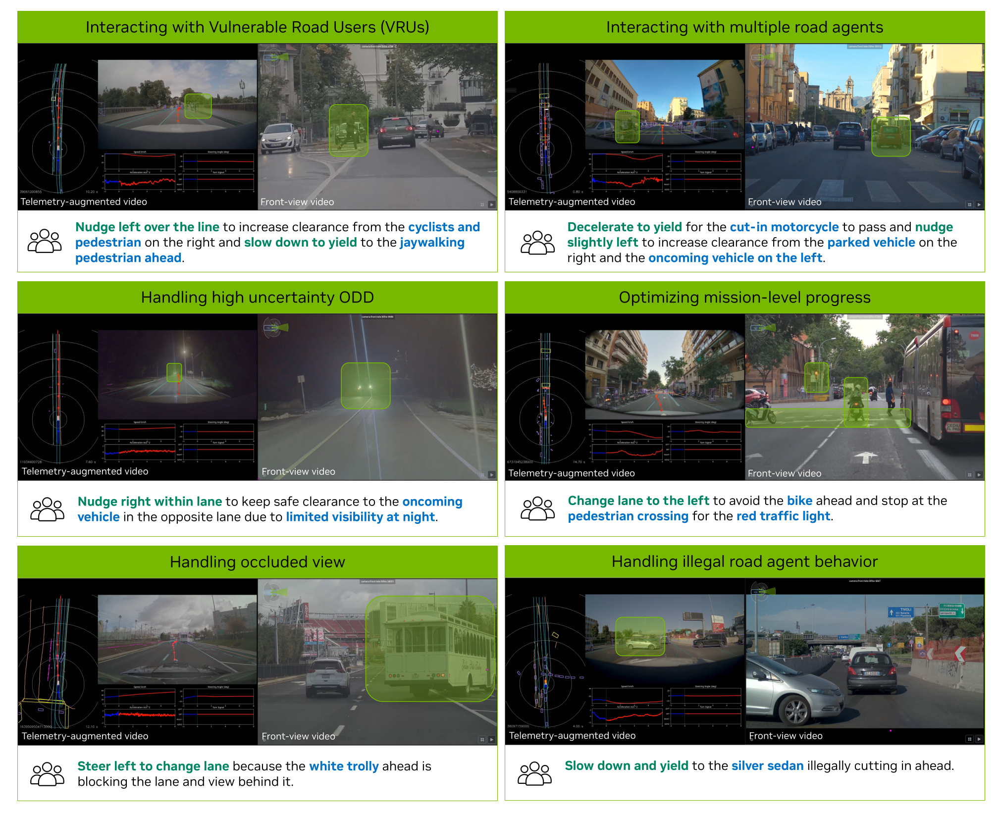

**Figure 4:** 라벨링된 CoC reasoning trace 예시. driving decision과 critical component가 CoC로 조직되고 대응되게 강조되어 있다.

**Meta Actions.** 이 meta action의 전체 목록은 Tab. 5에 제공된다. 이러한 low-level meta action은 atomic하며, ego vehicle trajectory의 instantaneous kinematic change를 나타낸다. 따라서 high-level driving decision과 구별된다. video segment 내 single high-level driving decision은 보통 longitudinal과 lateral 양방향에서 이러한 atomic meta action sequence로 구성된다. 예를 들어 left lane-change decision은 steer left, 차량 heading을 안정화하기 위한 짧은 steer right, 그리고 go straight의 sequence로 구성될 수 있으며, 흔히 gentle accelerate 및 maintain speed가 동반된다. 각 8초 data sample에 대해 우리는 longitudinal high-level driving decision과 lateral high-level driving decision을 각각 최대 하나씩 annotate하는 반면, atomic meta action은 10Hz로 자동 label된다.

**Table 5:** longitudinal 및 lateral direction에 대해 정의된 atomic meta action 목록. 이 meta action은 video segment 전체에 걸쳐 여러 atomic action으로 구성되는 high-level driving decision과 달리, frame level의 low-level trajectory에서 instantaneous kinematic change를 나타낸다.

| Longitudinal | Longitudinal | Lateral | Lateral |
| --- | --- | --- | --- |
| Gentle accelerate | Strong accelerate | Steer left | Steer right |
| Gentle decelerate | Strong decelerate | Sharp steer left | Sharp steer right |
| Maintain speed | Stop | Reverse left | Reverse right |
| Reverse | - | Go straight | - |

**Labeling Procedure.** 다음으로 우리는 GPT-5(OpenAI, 2025) 같은 state-of-the-art VLM을 사용하여 multi-step reasoning process를 통해 offline auto-labeling을 수행한다. 이 접근법은 large model의 world knowledge를 structured CoC annotation으로 distill하면서 efficiency와 cost의 균형을 맞춘다. human labeling pipeline과 유사하게, VLM은 identified driving decision, critical component, driving decision과 causal factor를 연결하는 concise reasoning trace로 구성된 structured reasoning trace를 생성한다. reasoning process를 지원하기 위해 auto-labeling pipeline은 raw video와 ego vehicle trajectory, dynamic states, meta actions를 포함한 auxiliary signal을 모델에 제공한다. video는 auto-labeling model의 context window 내 허용 input token budget과 information density의 균형을 맞추기 위해 2 Hz로 sampling된다.

causal confusion을 완화하기 위해, VLM은 critical component를 식별할 때 2초 historical video를 사용하도록 prompting된다. 이후 6초 future video와 ego trajectory 및 meta action은 multi-modality를 해소하고 corresponding driving decision을 결정하는 데 사용된다. 이 과정에서 모델은 identified causal factor의 importance를 rank하고, 최종 reasoning trace에는 driving decision에 직접 영향을 주는 것만 유지한다.

#### 4.3.3. Evaluation

open-ended text, 특히 reasoning trace의 평가는 AV research community에서 여전히 열린 과제이며, CoC의 causal-effect relationship 평가는 추가 복잡성을 도입한다. 기존 dataset은 일반적으로 다음 접근법 중 하나에 의존했다.

1. 작은 sample subset에 대한 human evaluation. labeler가 적절히 guided되면 효과적이지만, large-scale evaluation이나 labeling pipeline의 rapid iteration에는 scalable하지 않다.
2. BLEU(Papineni et al., 2002), METEOR(Banerjee and Lavie, 2005), CIDEr(Vedantam et al., 2015) 같은 heuristic-based metric. 이 metric은 shallow text similarity만 포착하고 underlying causal reasoning을 반영하지 못하므로 CoC dataset 평가에는 부적절하다.
3. LLM-based auto-evaluation. causal relationship을 reason하는 LLM 능력을 활용하고 large evaluation set으로 효과적으로 scale된다. 그러나 LLM은 복잡한 multi-step cause-and-effect chain을 평가할 때 특히 hallucination에 취약하다.

이러한 과제 때문에 기존 연구는 reasoning dataset evaluation을 위한 reliable method가 부족한 경우가 많았다.

**CoC Evaluation Procedure.** 이 과제를 해결하기 위해 우리는 human verification과 LLM-based auto-evaluation을 결합한 hybrid evaluation strategy를 채택한다. 구체적으로 GPT-5(OpenAI, 2025)를 LLM evaluator로 사용하고, Tab. 3의 representative scenario를 포괄하는 2K sample의 curated evaluation set을 구축한다. LLM evaluation 중 hallucination을 완화하기 위해 free-form text와 grading result를 직접 사용하지 않는다. 대신 evaluation process를 driving decision, causal factor의 존재, cause-and-effect relationship의 validity를 다루는 세 structured subtask로 분해한다. 이 측면들을 True/False question set으로 재구성함으로써 evaluation process는 더 해석 가능하고 human judgment와 더 잘 정렬된다. reliability를 검증하기 위해 동일한 version의 auto-labeled dataset에서 LLM-based auto-evaluation과 human evaluation을 비교했고, 92% alignment rate를 관찰하여 LLM-based auto-evaluation의 robustness를 확인했다. 이 evaluation method를 사용해, explicit driving decision과 critical component를 강제하지 않는 free-form reasoning trace 대비, 제안하는 structured CoC reasoning trace가 causal relationship score를 132.8% 개선함을 발견했다.

**Effectiveness of Imperfect Auto-Labels.** causal-effect evaluation에서 완벽한 100% score를 달성하는 것은 가능하더라도 auto-labeled data의 유용성을 위한 필요조건이 아니라는 점이 중요하다. 복잡한 driving scenario에서 causal reasoning의 본질적 ambiguity와 human-labeled ground truth 및 evaluation metric의 noise를 고려하면, 100% agreement가 합리적이거나 명확히 정의된 target인지 불분명하다. 대신 CoC auto-label의 주요 가치는 large-scale SFT를 가능하게 하여 diverse driving scenario 전반에서 AR1 generalization을 개선하는 데 있다. Sec. 6에서 보이듯, auto-labeled CoC trace로 학습한 모델은 reasoning supervision이 없는 baseline에 비해 이미 유의미한 개선을 달성한다. 또한 Sec. 5에서 설명하듯, 우리의 training pipeline은 reasoning capability와 causal consistency를 더 강화하는 후속 RL-based post-training step을 포함한다. 동시에 human annotation effort가 확장됨에 따라, human-labeled CoC reasoning trace를 사용한 추가 SFT round를 도입해 causal grounding과 interpretability를 점진적으로 개선할 계획이다.

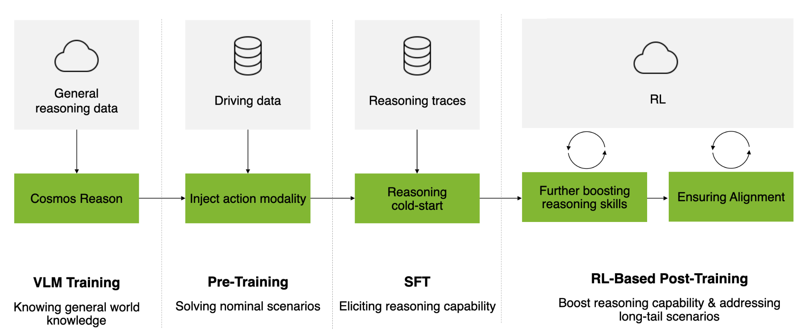

**Figure 5:** Alpamayo-R1 model training pipeline의 개요. 세 핵심 stage로 구성된다. (1) Action Modality Injection(Sec. 5.1), (2) Eliciting Reasoning(Sec. 5.2), (3) RL-Based Post-Training(Sec. 5.3).

## 5. Training Strategy

Sec. 3에서 소개한 Cosmos-Reason VLM backbone은 domain-specific SFT를 통해 foundational physical reasoning capability를 제공한다. 이를 바탕으로 우리는 VLM을 reasoning-capable autonomous driving policy로 변환하기 위해 three-stage training strategy를 채택한다. Fig. 5에 나타난 것처럼 각 stage는 robust하고 interpretable한 driving에 필수적인 서로 다른 capability를 점진적으로 향상시킨다. Sec. 5.1에서는 discrete trajectory token으로 학습하고 flow matching 기반 action-expert를 추가하여 action modality를 VLM에 주입함으로써, 모델이 vehicle control output을 예측할 수 있게 한다. Sec. 5.2에서는 CoC dataset(Sec. 4)에 대한 SFT로 model reasoning capability를 개선하여, 더 나은 driving decision을 위한 causally grounded explanation을 생성하도록 가르친다. 마지막으로 Sec. 5.3에서는 large reasoning model feedback을 사용하는 RL을 적용해 reasoning quality를 refine하고, reasoning trace를 executed action과 정렬하며, trajectory quality를 최적화하여 interpretable하고 safe한 driving behavior를 만든다.

### 5.1. Action Modality Injection

training 중 우리는 discrete token(Sec. 3.2.2)을 통해 action modality를 VLM에 주입하고, Eq. (1)에 정의된 training token sequence에 대해 cross-entropy loss로 VLM을 학습한다. Eq. (3)의 control-based representation에 따라 각 trajectory는 64 waypoint와 waypoint당 2개의 quantized value(acceleration `a_i`와 curvature `κ_i`)로 구성되어, trajectory당 128 discrete token을 만든다. 이는 action representation 전용 special token set으로 encoding된다. 그러나 아래에서 자세히 설명하듯 inference에는 discrete trajectory token을 사용하지 않는다.

**Dual Representation의 동기.** training 중 discrete tokenization과 inference 시 continuous flow-matching decoder를 함께 사용하는 것은 여러 핵심 장점을 제공한다. 첫째, discrete tokenization은 reasoning과 trajectory가 common token space를 공유하는 unified autoregressive training을 가능하게 하여, 표준 next-token prediction을 통해 VLM이 causal explanation과 vehicle behavior를 밀접하게 결합하도록 한다. 둘째, discrete representation은 post-training(Sec. 5.3) 중 direct gradient flow를 허용하여 RL optimization을 촉진하고, GRPO(Shao et al., 2024) 같은 policy gradient method가 reasoning quality와 reasoning-action consistency를 함께 refine하도록 한다. 셋째, discrete representation은 vehicle dynamics 학습을 위한 강한 supervision을 제공하는 반면, flow-matching expert는 physically feasible하고 multi-modal한 output을 보장한다. 마지막으로 flow-matching decoding은 128 discrete token을 autoregressive하게 sampling하는 것보다 훨씬 빠르게 continuous trajectory를 생성하여 real-time inference를 가능하게 한다.

`π0.5-KI`(Driess et al., 2025)와 유사하게, 우리는 flow matching(Janner et al., 2022; Lipman et al., 2023; Zhong et al., 2023; Jiang et al., 2023)을 통해 action을 decode하는 별도 action-expert를 채택한다. action-expert는 VLM과 같은 Transformer architecture를 따르며 attention head 수와 attention dimension은 동일하게 사용하지만, 효율성을 위해 더 작은 hidden embedding size와 MLP dimension을 사용한다. diffusion schedule의 각 diffusion timestep `t`에서 action-expert는 VLM의 sequence `[o_image, o_egomotion, Reason]`에서 나온 KV-cache와 noisy control `a_t`의 embedded representation을 input으로 받는다. diffusion time `t`도 embed되어 feature에 더해진다. 이후 expert는 final layer feature를 MLP head로 projection하여 vector field `v_Θ(a_t, o, Reason)`를 예측하며, `Θ`는 learnable parameter를 나타낸다. action-expert는 vanilla conditional flow matching loss(Lipman et al., 2023)로 학습한다.

```text
L_cfm(Θ) = E_{t∈p_schedule,(o,Reason)∈D_data}
          ||v_Θ(a_t, o, Reason) - u(a_t|a)||                         (6)
```

실제로는 Gaussian conditional optimal transport(OT) path를 채택하고 `ε ∼ N(0, I)`에서 `a_t = t a + (1 - t) ε`를 sampling한다. 이때 target vector field는 closed-form expression을 갖는다.

```text
u(a_t|a) = a - ε                                                       (7)
```

inference 중에는 `a_0 ∈ N(0, I)`에서 시작하여 Euler integration으로 denoising을 수행한다.

```text
a_{t+δt} = a_t + δt v_Θ(a_t, o, Reason)                               (8)
```

기본적으로 inference 중 `δt = 0.1`을 사용하고, training 중에는 Physical Intelligence et al. (2025)이 제안한 것처럼 `p_schedule`을 shifted beta distribution으로 설정한다. training 중 expert의 gradient가 VLM weight로 back-propagating되는 것을 방지하기 위해 VLM이 생성한 KV-cache에 stop-gradient를 적용한다.

### 5.2. Eliciting Reasoning

Sec. 5.1에서 action generation capability를 갖춘 VLA를 확립한 뒤, 다음 과제는 특정 driving decision이 왜 내려지는지 설명하는 structured and causally grounded reasoning을 모델이 수행하게 하는 것이다. 이 능력은 imitation learning의 pure pattern matching이 실패할 수 있는 복잡하고 safety-critical한 scenario를 처리하는 데 중요하다(Wei et al., 2022). 이를 위해 우리는 Sec. 4에서 소개한 structured CoC dataset을 활용한다. 이 dataset은 expert trajectory와 paired된 decision-grounded, causally linked reasoning trace를 제공한다. CoC dataset에 대해 SFT를 수행하여 모델이 imitation을 통해 reasoning trace를 생성하도록 가르치며, 각 reasoning trace는 explicit driving decision(Tab. 1)에 anchor되고 critical scene component(Tab. 2)에 grounded된다. SFT가 기본 reasoning capability를 scaffold할 수 있게 하지만, Sec. 5.3에서 RL을 통해 reasoning quality를 더 refine하고 reasoning-action consistency를 강제한다.

형식적으로 각 training sample은 multi-camera driving scene observation `o = [o_image, o_egomotion]`, ego vehicle decision 뒤의 causal factor를 설명하는 structured CoC reasoning trace `Reason`, 그리고 Eq. (3)에 정의된 corresponding ground-truth control-based trajectory representation `a`로 구성된다. Eq. (1)의 sequence formulation에 따라 SFT objective는 reasoning-action sequence의 conditional log-likelihood를 maximization한다.

```text
L_SFT(θ) = - E_{(o,Reason,a)∼D_CoC} [ log π_θ(Reason, a | o) ]          (9)
```

여기서 `π_θ`는 vision encoder, language backbone, corresponding embedding adapter를 포함하는 parameter `θ`의 VLA policy를 나타낸다. 실제로는 reasoning token과 Sec. 5.1에서 설명한 discrete trajectory token(trajectory당 128 token) 모두에 cross-entropy loss를 적용하여, language-based reasoning과 action prediction의 joint distribution을 unified autoregressive framework에서 학습하게 한다.

**SFT만으로는 충분하지 않은 이유.** 이 imitation learning stage는 모델이 human-like reasoning pattern을 internalize하게 하여, 특정 visual 및 contextual cue가 주어졌을 때 어떤 action을 취해야 하는지뿐 아니라 왜 그런 action이 적절한지도 학습한다. Fig. 8에서 보듯 CoC data에 대한 SFT는 explicit reasoning supervision 없이 학습한 모델보다 trajectory prediction accuracy를 이미 측정 가능한 수준으로 개선한다. 그러나 SFT는 VLA model이 reasoning trace를 scaffold하도록 해도 본질적으로 여러 요인에 의해 제한된다.

1. Data bias and annotation noise: auto-labeled data는 불완전한 causal relationship(Sec. 4.3.1)을 포함할 수 있어 모델이 robust causal reasoning 대신 annotation artifact에 overfit할 수 있다.
2. Limited generalization: 모델이 더 깊은 causal understanding을 개발하지 못하고 common reasoning pattern을 memorize하여 novel scenario에 일반화하지 못할 수 있다.
3. Weak visual grounding: next-token prediction은 visual consistency를 강제하지 않으므로, 모델이 scene에 존재하지 않는 causal factor를 hallucinate할 수 있다(Fig. 10).
4. Reasoning-action inconsistency: joint optimization은 stated reasoning과 predicted trajectory 사이의 alignment를 명시적으로 강제하지 않으므로 contradictory explanation이 발생할 수 있다(Fig. 11).

다음 섹션(Sec. 5.3)에서는 large reasoning model feedback과 explicit reasoning-action consistency reward를 사용하는 RL-based post-training으로 이러한 한계를 완화하는 접근법을 설명한다.

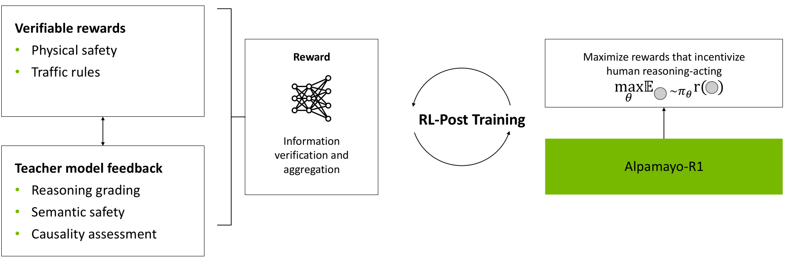

**Figure 6:** RL-based post-training framework의 개요. 우리는 reasoning quality(large reasoning model feedback 사용), reasoning-action consistency, trajectory quality라는 세 reward component를 최적화하여 모델이 생성한 reasoning trace를 predicted action과 정렬한다.

### 5.3. RL-based Post-Training

Sec. 5.2에서 설명한 SFT의 한계를 해결하기 위해, 우리는 Fig. 6에 나타낸 RL-based post-training framework를 도입한다. 이 framework는 세 가지 상호 보완적 reward signal, 즉 reasoning quality(large reasoning model feedback), reasoning-action consistency, trajectory quality를 최적화한다. teacher forcing 아래 expert demonstration의 likelihood를 최적화하고 test-time inference error에 대한 feedback이 없는 SFT와 달리, RL은 모델 자신의 rollout에 대해 explicit inference feedback을 제공하여 optimization objective를 실제 deployment 방식과 정렬한다. 이 접근법은 reasoning의 causal correctness와 executed action과의 alignment를 모두 평가하는 targeted feedback을 제공함으로써 SFT의 단점을 직접 다루며, 동일 compute budget에서 robustness와 generalization에 불균형적으로 더 큰 이득을 제공한다.

#### 5.3.1. Post-Training Algorithm

Large-scale foundation model post-training은 large-scale foundation model의 reasoning capability와 generation quality를 향상시키는 핵심 전략으로 부상했다(Christiano et al., 2017; DeepSeek-AI, 2025). 최근 이러한 technique은 embodied AI domain으로 확장되어 VLA model이 autonomous driving(Tian and Goel, 2025)과 generalist robotic agents(Tian et al., 2024; Zhang et al., 2025)을 포함한 다양한 embodiment에서 human intent를 더 잘 반영하는 action을 생성하도록 장려한다. 우리의 reasoning VLA context에서 alignment stage는 motion generation 개선을 넘어선다. embodied setting에 grounded된 reasoning quality를 명시적으로 향상시키고, interpretable하고 trustworthy한 autonomy를 달성하기 위한 핵심 속성인 reasoning-action consistency를 강제한다.

우리는 alignment algorithm으로 GRPO(Shao et al., 2024)를 채택한다. GRPO는 absolute reward signal에 의존하지 않고 sampled model rollout group 내 relative advantage를 최적화함으로써 standard policy gradient method를 확장한다. 구체적으로 current model `π_θ`에서 sampling된 model rollout group `{τ_i}_{i=1}^K`와 각 rollout의 scalar reward `r_i`가 주어지면, GRPO objective는 다음과 같이 정의된다.

```text
L_GRPO(θ) = - E_{τ_i∼π_θ} [
  Σ_i exp(β A_i) / Σ_j exp(β A_j)
  (log π_θ(τ_i) - λ_KL KL[π_θ(τ_i) || π_ref(τ_i)])
],
A_i = r_i - r_bar                                                   (10)
```

여기서 `A_i`는 group 내 각 trajectory의 relative advantage, `r_bar`는 group-average reward, `β`는 weighting distribution의 sharpness를 제어한다. coefficient `λ_KL`을 갖는 KL regularization term은 reference policy `π_ref`(일반적으로 SFT model)에서 벗어나는 것을 penalize하여 noisy 또는 biased reward signal에 대한 over-optimization을 방지하고, pre-training 중 학습된 linguistic 및 behavioral prior를 보존한다.

#### 5.3.2. Reward Model

우리 reward model은 모델이 무엇을 reason하는지와 어떻게 act하는지를 함께 평가하는 세 가지 complementary signal을 통합한다. 구체적으로 각 rollout의 total reward `r`은 reasoning quality reward, reasoning-action consistency, low-level trajectory quality의 세 component로 구성된다.

**대형 추론 모델로 Reasoning 채점.** reasoning trace가 그럴듯하지만 unsafe하거나 causally inconsistent한 plan을 생성하는 hallucination 문제를 완화하기 위해, 우리는 large reasoning model(LRM)을 automatic evaluator로 사용하여 reasoning quality에 대한 scalable하고 high-quality feedback을 제공한다. expert model이 scalable feedback을 제공하는 LLM alignment의 최근 발전(Bai et al., 2022; Lee et al., 2023)에서 영감을 받아, 우리는 state-of-the-art LRM(예: DeepSeek-R1(DeepSeek-AI, 2025), Cosmos-Reason(NVIDIA et al., 2025))을 reasoning critic으로 활용해 VLA가 생성한 reasoning trace의 quality를 평가한다. 우리는 LRM을 critic으로 선택했다. 이러한 모델은 limited embodiment prior 때문에 driving-specific reasoning을 생성하는 데 어려움을 겪을 수 있지만, 강력한 verification 및 evaluation capability를 보인다. 즉, 이 domain에서 generation이 불완전하더라도 logical soundness, causal alignment, contextual consistency를 평가하는 능력은 매우 reliable하다. 이는 generation-verification gap(Song et al., 2024)으로도 알려져 있다. 결과 reward signal은 reasoning quality의 continuous measure를 제공하여, RL이 모델의 grounded하고 logically consistent한 reasoning 생성 능력을 반복적으로 refine하게 한다.

**Reasoning Critic Design.** 각 training sample에 대해 LRM critic은 2초 history window의 마지막 frame에서 multi-camera visual observation `o_image`, dataset의 ground-truth CoC reasoning trace `Reason_GT`, current policy `π_θ`가 생성한 model-generated reasoning trace `Reason_pred`를 input으로 받는다. critic은 `Reason_pred`가 `Reason_GT`와 얼마나 잘 정렬되는지를 두 차원에서 평가한다. 첫째, behavior consistency, 즉 predicted reasoning이 ground truth와 일관된 driving decision을 설명하는지. 둘째, causal reasoning quality, 즉 CoC principle(Sec. 4.1)에 따라 scene history에서 관찰 가능한 causal factor를 올바르게 식별하는지. critic은 behavior consistency와 causal reasoning consistency에 초점을 맞춘 structured rubric에 따라 predicted reasoning을 grade한다.

```text
Prompt: LLM Reasoning Grading Rubric

당신은 자율주행 reasoning trace를 평가하는 전문가다. reasoning trace는 ego vehicle이 무엇을 해야 하는지,
그리고 그 behavior로 이어지는 reason과 factor를 설명한다. 당신의 임무는 predicted reasoning trace(PRED)가
behavior consistency와 causal reasoning 측면에서 ground truth(GT)와 얼마나 잘 정렬되는지 점수화하는 것이다.
Scoring rubric (0-5):
    5 Behavior와 causal reasoning이 완전히 일관됨.
    4 Behavior는 정확하고 causal reasoning은 대부분 일관됨.
    3 Behavior는 대체로 정확하지만 reasoning이 불완전하거나 약간 부정확함.
    2 Behavior가 부분적으로 부정확하거나 reasoning이 대체로 일관되지 않음.
    1 Behavior가 틀렸거나 GT와 모순됨.
    0 완전히 무관하거나 반대임.
```

결과 scalar score `r_reason`이 reasoning reward로 사용된다. 이 signal은 모델이 올바른 driving behavior를 설명할 뿐 아니라 causal fidelity를 유지하고 visual context와 traffic cue에 기반해 왜 action이 취해지는지 정확히 설명하는 reasoning trace를 생성하도록 장려한다.

**CoC-Action Consistency.** 모델의 action generation이 reasoning을 충실히 따르도록 하기 위해, 우리는 generated reasoning trace와 corresponding predicted ego trajectory 사이의 behavioral alignment를 측정하는 CoC-action consistency reward를 도입한다. 구체적으로 각 reasoning-action rollout에 대해 predicted motion trajectory를 Sec. 4.3.1에서 설명한 meta-action sequence(interpretable motion primitive)로 변환한다. 이 meta-action은 longitudinal(acceleration/braking)과 lateral(steering) direction 모두에서 ego vehicle control behavior를 encoding한다. 그런 다음 generated reasoning trace를 parse하여 ego의 intended behavior를 infer하고, predicted trajectory에서 도출한 meta-action과 rule-based matching으로 비교한다. reasoning trace에 설명된 behavior와 meta-action이 두 축 모두에서 일관되면 `r_consistency = 1`을 할당하고, 그렇지 않으면 `r_consistency = 0`을 할당한다. reasoning을 valid driving decision으로 parse할 수 없는 경우, 즉 auto-labeling에 사용된 closed decision set 내 intent가 인식되지 않는 경우에는 보수적으로 `r_consistency = 0`을 부여한다. 단순한 rule-based logic에 기반하지만, 이 binary reward는 모델의 reasoning-action coupling의 trustworthiness를 개선하는 데 중요한 역할을 한다. inconsistency를 명시적으로 penalize하고 correct match에만 reward를 부여함으로써, reasoning이 그럴듯하게 들릴 뿐 아니라 coherent하고 physically consistent한 behavior로 translate되도록 모델을 장려한다.

**Low-Level Trajectory Quality.** 생성된 motion trajectory가 physically feasible하고 comfortable하며 safe하게 실행되도록 하기 위해, continuous space에서 모델의 motion output을 평가하는 low-level trajectory quality reward를 포함한다. 이 component는 reasoning 및 consistency level reward를 보완하여 trajectory의 physical property를 직접 regularize한다. reward는 세 term을 결합한다.

```text
r_traj = λ_L2 ||x_pred - x_expert||_2^2
       + λ_coll I[collision(x_pred)]
       + λ_jerk J(x_pred)                                           (11)
```

여기서 `x_pred`와 `x_expert`는 각각 predicted trajectory와 expert trajectory를 나타낸다. `I[collision(x_pred)]`는 predicted motion이 주변 obstacle과 collision을 일으키는지 나타내는 binary indicator이며, `J(x_pred)`는 abrupt하거나 uncomfortable한 motion을 penalize하기 위한 jerk magnitude를 측정한다. L2 imitation term은 expert demonstration에 가까워지도록 장려하여 stable learning과 smooth driving profile을 촉진한다. collision penalty는 safety를 보장하고, jerk regularization은 comfort와 control smoothness를 개선한다. 이 term들은 함께 모델 학습을 human-like, safe, comfortable motion에 anchor하여 alignment process 중 생성되는 trajectory의 physical plausibility를 강화한다.

#### 5.3.3. Cost-Effective Training을 위한 Post-Training Data Curation

RL-based post-training은 iterative nature 때문에 computationally expensive하다. 각 policy update에는 여러 model rollout, reward evaluation, large batch의 reasoning 및 trajectory sample에 대한 gradient step이 필요하다. 또한 loss가 labeled data에서 직접 계산되는 SFT stage와 달리, 우리의 post-training procedure는 on-policy sampling과 LRM-based reward function call을 포함하므로 compute와 data cost가 모두 증폭된다. 따라서 RL을 full pre-training data로 확장하는 것은 training time과 compute resource 측면에서 prohibitive하다. 이를 해결하기 위해 우리는 RL post-training을 위한 high-information-gain dataset을 curate한다. 핵심 아이디어는 모델의 implicit reward signal(logit에 encoding됨)이 explicit reward model과 disagree하는 sample을 우선하는 것이다.

구체적으로 model에서 각 sample rollout `τ_i`에 대해, logit에서 도출한 model predicted probability distribution과 reward가 암시하는 corresponding probability distribution을 계산한다. reward distribution은 reward를 Boltzmann distribution으로 변환하여 얻는다.

```text
p_reward(τ_i) = exp(β r_i) / Σ_j exp(β r_j)
```

이 두 distribution 사이의 divergence가 크면 모델의 internal preference, 즉 implicit reward가 externally defined reward signal과 conflict함을 의미한다. 이러한 disagreement는 모델의 learned reward가 부정확한 sample을 드러내므로 alignment에 특히 가치가 있다. 따라서 우리는 이러한 high-disagreement sample을 우선하여 focused post-training dataset을 구축하고, distributional diversity를 보존하고 training을 안정화하기 위해 유사한 비율의 randomly sampled data를 혼합한다. RL update를 이 hybrid set에 집중함으로써, uniformly sampled data에 비해 높은 alignment efficiency와 robust learning dynamics를 모두 달성한다.

#### 5.3.4. Post-Training Infrastructure

RL experiment를 수행하기 위해 우리는 AV reasoning task에 특화된 Cosmos-RL framework(NVIDIA, 2025)의 customized version을 개발했다. 이 system은 large-scale multimodal RL을 위한 scalable하고 modular한 infrastructure를 제공하며 Alpamayo-R1 system의 다른 부분과 직접 맞물린다. distributed data loading, mixed-parallelism training, vLLM-based rollout generation(Kwon et al., 2023), multiple GPU node에 걸친 reward computation을 지원하여 efficient하고 high-throughput한 policy optimization을 가능하게 한다.

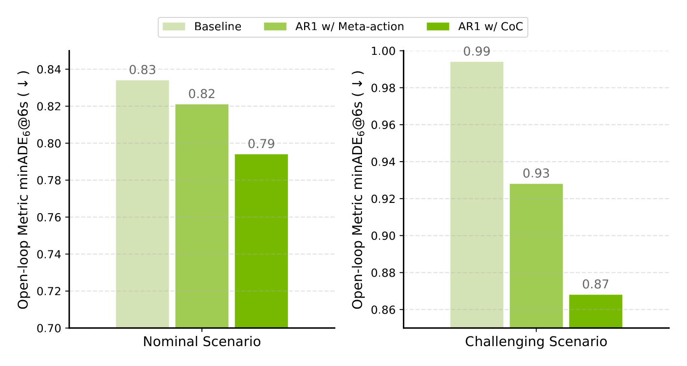

**Figure 7:** trajectory만 출력하거나 meta-action과 trajectory만 출력하는 모델과 비교할 때, Alpamayo-R1은 nominal scenario와 challenging scenario 모두에서 개선을 달성한다.

## 6. Experiments

우리는 Alpamayo-R1의 reasoning capability, trajectory prediction accuracy, closed-loop driving performance를 평가하기 위해 여러 차원에서 포괄적 평가를 수행한다. 먼저 Fig. 7에서 제안하는 Alpamayo-R1이 trajectory-only baseline을 크게 능가함을 강조한다. 특히 더 나은 driving decision을 위해 복잡한 reasoning이 직관적으로 필요한 challenging scenario에서 두드러진다.

이후 섹션에서는 먼저 Sec. 6.1에서 evaluation protocol을 제시한다. 다음으로 Sec. 6.2에서 reasoning-capable model이 개선된 driving policy에 어떻게 기여하는지 설명한다. Sec. 6.3에서는 RL을 통해 달성한 behavioral alignment 개선을 추가로 보인다. Sec. 6.4부터 Sec. 6.6까지는 backbone model, trajectory expert model, vision encoder에 대한 comprehensive ablation study를 수행하여 제안한 methodology의 효과에 대한 더 깊은 insight를 얻는다. 마지막으로 real-world performance를 보여주는 on-vehicle demonstration을 제시한다.

### 6.1. Evaluation Protocol

우리 evaluation strategy는 네 가지 상호 보완적 component로 구성된다.

1. planning accuracy를 측정하기 위한 nominal 및 long-tail driving scenario에서의 open-loop trajectory prediction
2. 모델이 realistic scenario에서 vehicle을 control할 때 safety와 robustness를 평가하기 위한 AlpaSim(NVIDIA et al., 2025) closed-loop simulation
3. vision-language model scaling, vision encoding strategy, reasoning integration, action decoding strategy 등 key architectural choice의 영향을 검토하는 ablation study
4. autonomous driving scenario에서 모델의 real-world deployment를 검증하기 위한 on-vehicle road test

**Dataset.** 우리는 미국과 EU의 다양한 geographic region에서 수집한 internal driving data로 모델을 학습하고 평가한다. 모든 evaluation data는 information leakage를 방지하기 위해 training region과 엄격하게 geo-fenced되고 held out된다. 평가에는 dataset `D_overall`의 nominal driving scenario와 `D_hard`의 challenging long-tail case가 모두 포함되어, rare하고 safety-critical한 event를 처리하는 모델 능력을 철저히 test한다. 자세히 말해 full training 및 evaluation dataset은 25개국 1,700개 이상 도시에서 운행한 여러 ego-vehicle로부터 수집한 80,000시간의 driving data로 구성된다. highway 및 urban environment, 다양한 weather condition, time of day, traffic density를 포함한다. raw sensory input은 surround-view seven-camera setup의 video recording과 precise camera calibration parameter 및 ego-motion data로 구성된다. 본 연구에서는 near-field와 far-field scene understanding을 위한 complementary perspective를 제공하는 두 front-facing camera, 즉 120도 field of view의 front wide-angle camera와 30도 field of view의 front telephoto camera를 input으로 사용하는 데 초점을 둔다.

general driving dataset `D_overall` 외에도, 우리는 structured CoC를 포함하는 700K video segment로 구성된 CoC dataset(Sec. 4)을 구축한다. 이 dataset은 reasoning capability를 유도하기 위한 model fine-tuning(Sec. 6.2)과 RL-based post-training alignment(Sec. 6.3)에 사용된다.

**Open-Loop Evaluation.** open-loop trajectory prediction에서는 ego-vehicle의 planned waypoint에 해당하는 6초 prediction horizon으로 모델을 평가한다. evaluation metric으로 minADE와 ADE를 사용한다. minADE는 6개의 sample(minADE6)에서 계산되며, ground-truth future trajectory와 모델이 생성한 6개 prediction 중 best-matching trajectory 사이의 minimum distance로 정의된다. ADE(Average Displacement Error)는 모든 future timestep에 걸쳐 predicted trajectory와 ground-truth trajectory 사이의 average distance다.

**Closed-Loop Evaluation.** strong open-loop result가 반드시 reliable closed-loop driving performance로 이어지지는 않는다는 점은 잘 알려져 있다(Dauner et al., 2023). 이 간극을 해결하기 위해, state-of-the-art neural reconstruction technology(Wu et al., 2025)에 기반한 open-source closed-loop end-to-end simulator인 AlpaSim(NVIDIA et al., 2025) 내에서 모델을 추가로 평가한다. AlpaSim은 recorded real-world driving log에서 temporal 3D Gaussian Splatting representation을 활용하고, closed-loop evaluation 중 ego vehicle이 recorded trajectory에서 벗어날 때 이를 사용해 novel viewpoint를 synthesize한다. evaluation 중 predicted trajectory는 model predictive controller(MPC)가 tracking하며, vehicle dynamics는 dynamically extended bicycle model을 따른다. vehicle과 pedestrian을 포함한 traffic agent는 recorded trajectory를 따른다.

우리는 dense ego-agent 및 agent-agent interaction 때문에 선택된 75개의 challenging 20-second scenario에서 모델을 평가한다. 제한된 set처럼 보일 수 있으나, 이 scenario들은 복잡한 reasoning과 interactive decision-making이 필요한 가장 demanding한 safety-critical situation을 나타내도록 특별히 curate되었다. 다음 AlpaSim metric을 보고한다.

1. offroad rate: ego vehicle이 drivable area 밖으로 주행하는 scenario의 비율
2. close encounter rate: ego vehicle이 다른 traffic agent와 close encounter를 겪는 scenario의 비율
3. AlpaSim score: event 사이의 평균 주행 거리(km). event는 offroad 또는 close encounter occurrence에 해당한다.
4. AlpaSim score at fault: ego vehicle이 responsible하다고 판단된 close encounter만 고려한 AlpaSim score. 즉 rear-end close encounter는 제외한다.

simulation은 첫 close encounter 또는 off-road event 후 종료된다. rendering artifact를 완화하기 위해 ego가 원래 recorded trajectory에서 4 m 이상 벗어나는 event는 모든 metric computation에서 제외된다.

**Table 6:** CoC dataset에서의 model open-loop evaluation. base model은 `D_overall`로 pre-trained되었고, 다른 모든 model은 CoC dataset으로 fine-tuned된 뒤 held-out CoC test data에서 평가된다. 각 setting에서 가장 좋은 값은 원문에서 green background로 표시되어 있다.

| ID | Model Name | Route | Parameters | minADE6 @3s↓ | minADE6 @6s↓ |
| --- | --- | --- | --- | --- | --- |
| 1 | Base model (action modality) | × | 0.5B | 0.284 | 0.996 |
| 2 | + Ft. w/ Traj. | × | 0.5B | 0.282 | 0.971 |
| 3 | + Ft. w/ Meta-action & Traj. | × | 0.5B | 0.291 | 0.988 |
| 4 | + Ft. w/ CoC & Traj. (AR1) | × | 0.5B | 0.279 | 0.955 |
| 5 | Base model (action modality) | × | 3B | 0.291 | 0.977 |
| 6 | + Ft. w/ Traj. | × | 3B | 0.293 | 0.976 |
| 7 | + Ft. w/ Meta-action & Traj. | × | 3B | 0.280 | 0.927 |
| 8 | + Ft. w/ CoC & Traj. (AR1) | × | 3B | 0.275 | 0.908 |
| 9 | Base model (action modality) | ✓ | 0.5B | 0.264 | 0.848 |
| 10 | + Ft. w/ Traj. | ✓ | 0.5B | 0.262 | 0.834 |
| 11 | + Ft. w/ Meta-action & Traj. | ✓ | 0.5B | 0.264 | 0.821 |
| 12 | + Ft. w/ CoC & Traj. (AR1) | ✓ | 0.5B | 0.254 | 0.794 |

**Table 7:** challenging dataset에서의 model open-loop evaluation. 모든 model은 CoC dataset으로 fine-tuned되고 challenging dataset에서 평가된다.

| ID | Model Name | Route | Parameters | minADE6 @3s↓ | minADE6 @6s↓ |
| --- | --- | --- | --- | --- | --- |
| 1 | Ft. w/ Traj. | ✓ | 0.5B | 0.315 | 0.994 |
| 2 | Ft. w/ Meta-action & Traj. | ✓ | 0.5B | 0.301 | 0.928 |
| 3 | Ft. w/ CoC & Traj. (AR1) | ✓ | 0.5B | 0.290 | 0.868 |

### 6.2. Policy Improvements from Reasoning

이 연구의 핵심 기여 중 하나는 proposed CoC data를 사용해 driving policy를 개선하는 것이다. reasoning이 driving performance에 미치는 영향을 평가하기 위해, 우리는 action modality injection(Sec. 5.1)과 함께 `D_overall`로 pre-trained된 base model에서 시작해, meta-action description 및 full chain-of-causation reasoning trace라는 서로 다른 reasoning modality로 CoC dataset에 fine-tuning한다. inference 중 CoC reasoning으로 학습한 model은 trajectory prediction과 함께 explicit reasoning output을 생성하여, multi-step decision making이 필요한 challenging scenario를 더 잘 처리할 수 있다. 우리는 세 가지 fine-tuning strategy를 비교한다. (1) trajectory prediction only, (2) meta-action and trajectory prediction, (3) chain-of-causation reasoning and trajectory prediction(Alpamayo-R1). 모든 model은 route information이 제공되는 setting과 제공되지 않는 setting 모두에서 held-out CoC test data로 평가된다.

**Open-Loop Improvements.** Tab. 6(nominal scenario)과 Tab. 7(challenging scenario)에 나타난 것처럼, CoC reasoning을 포함하면 두 setting 모두에서 open-loop trajectory prediction이 크게 개선된다. route information 없이 AR1은 6s에서 minADE6 0.955m를 달성하여 base model 대비 4.1% 개선하고, trajectory-only(0.971m)와 meta-action(0.988m) baseline을 모두 능가한다. route information이 있을 때 이득은 더 두드러진다. AR1은 0.794m를 달성하여 trajectory-only baseline(0.834m) 대비 4.8% 개선을 나타낸다. 3B parameter로 확장하면 성능이 추가 개선되어 AR1-3B는 0.908m(route 없음)를 달성하며, complex reasoning task에서 model capacity 증가의 이점을 보여준다. challenging scenario에서는 개선 폭이 더 커서 AR1은 0.868m를 달성하고 trajectory-only baseline(0.994m) 대비 12% 개선을 보인다.

이 결과는 explicit reasoning capability가 model이 route guidance 같은 contextual information을 더 효과적으로 활용하고 future interaction 예측이 필요한 complex driving scenario를 처리하도록 함을 입증한다. Fig. 8은 CoC-enabled model이 challenging scenario에서 correct reasoning trace를 생성하고 vehicle에 yield하는 반면, baseline model은 이러한 interaction을 예측하지 못하는 qualitative example을 보여준다.

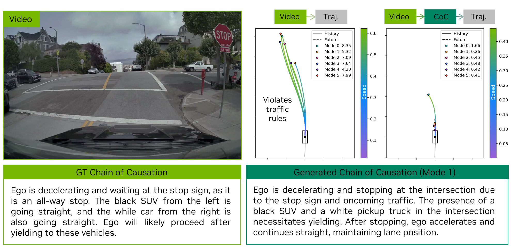

**Figure 8:** reasoning 유도를 통한 policy improvement. Alpamayo-R1은 all-way stop sign intersection에서 correct reasoning trace를 생성하고 ego보다 먼저 intersection에 진입한 다른 vehicle에게 yield한다.

**Closed-Loop Improvements.** Tab. 8에 나타난 것처럼 AR1은 trajectory-only baseline 대비 off-road rate를 35%(17%에서 11%) 줄이고 close encounter rate를 25%(4%에서 3%) 줄였다. 전체 AlpaSim score는 0.38에서 0.50으로 개선되어 reasoning-based decision making이 dynamic closed-loop scenario에서 safety를 향상시킴을 보여준다. Fig. 9는 AlpaSim 내 challenging scenario에서 우리 모델이 closed-loop driving을 성공적으로 수행할 수 있음을 보여주는 두 qualitative example을 제시한다.

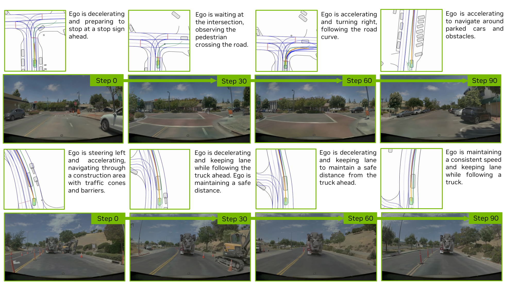

**Figure 9:** AlpaSim(NVIDIA et al., 2025)의 closed-loop evaluation 예시. 위 행은 intersection scenario를, 아래 행은 construction scenario를 보여준다.

**Table 8:** AlpaSim(NVIDIA et al., 2025)의 closed-loop evaluation 결과. 모든 model은 route information 없이 75개 challenging scenario에서 평가된다. Baseline은 CoC training data로 fine-tuned되었지만 reasoning 없이 학습된 trajectory-only model을 의미한다.

| Model | Off-Road Rate ↓ (%) | Close Encounter Rate ↓ (%) | AlpaSim Score ↑ | AlpaSim Score (at fault) ↑ |
| --- | --- | --- | --- | --- |
| Baseline | 17.0±3.0 | 4.0±3.0 | 0.38±0.04 | 0.86±0.11 |
| Alpamayo-R1 | 11.0±2.0 | 3.0±2.0 | 0.50±0.08 | 0.87±0.18 |

### 6.3. RL Post-Training을 통한 Reasoning, Consistency, Safety 개선

CoC data에 대한 SFT는 모델이 reasoning trace와 action을 함께 생성하도록 하지만, 이러한 trace가 causally grounded되어 있는지 또는 resulting action이 reasoning을 충실히 반영하고 human driving norm과 정렬되는지는 보장하지 않는다. 이 간극을 해결하기 위해 우리는 RL-based post-training을 적용하여 reasoning quality, reasoning-action consistency, trajectory quality를 동시에 개선한다(methodology detail은 Sec. 5.3 참조). 이 섹션에서는 CoC data로 fine-tuned된 0.5B AR1 model을 post-train하고, 서로 다른 reward component가 model behavior에 미치는 영향을 보여준다.

**LRM Feedback에서 학습하는 가치.** model reasoning trace가 fluent할 뿐 아니라 causally grounded되고 contextually accurate하도록 하기 위해, 우리는 LRM feedback에서 도출한 reasoning reward를 도입한다(Sec. 5.3에 자세한 설명). 이 reward는 각 generated reasoning trace의 driving scene에 대한 logical consistency와 causal correctness를 측정하는 continuous evaluation signal을 제공한다. 구체적으로 reasoning reward가 적용되면 여섯 generation 중 most-likely rollout의 average reasoning score가 약 45%(3.1→4.5) 개선된다. Fig. 10에서는 post-training 전후 모델의 behavioral difference를 보여주는 두 qualitative example을 제시한다. 왼쪽 scenario에서 ego vehicle은 construction site에 접근한다. SFT-pretrained model이 생성한 most-likely mode는 construction barrier를 간과하고 scene을 normal driving situation으로 묘사하여 evasive behavior의 필요성을 인식하지 못한다. 그러나 post-training 이후 모델의 reasoning은 construction area에 올바르게 주의를 기울이고, ego vehicle이 obstacle을 피하기 위해 nudge right해야 한다고 설명한다. 마찬가지로 오른쪽 scenario에서는 두 pedestrian이 path를 곧 clear하려고 한다. SFT-pretrained model의 most-likely mode는 이 contextual cue를 간과하고 ego vehicle이 accelerate할 준비를 해야 함을 예측하지 못한다. post-training 이후 모델은 pedestrian이 drivable area를 벗어나고 있음을 올바르게 인식하고 ego vehicle이 motion을 resume해도 안전하다고 reason한다.

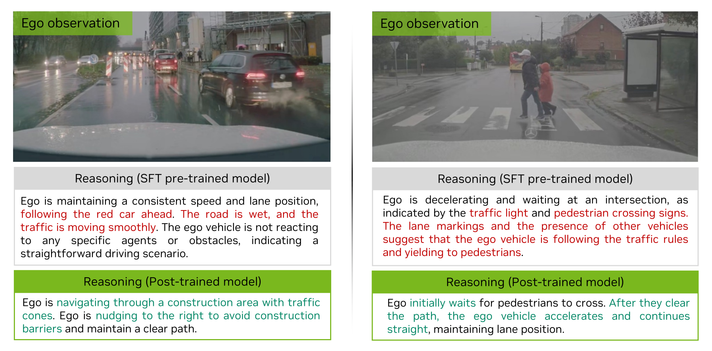

**Figure 10:** reasoning reward를 사용한 post-training은 driving scenario에서 causal understanding과 contextual reasoning을 개선한다. 왼쪽: base model은 construction barrier를 간과하고 evasive action을 시작하지 못하지만, post-trained model은 ego가 obstacle을 피하기 위해 nudge right해야 한다고 올바르게 reason한다. 오른쪽: base model은 pedestrian이 path를 clear하고 있음을 놓치지만, post-trained model은 ego vehicle이 accelerate해도 안전하다고 올바르게 reason한다.

**Table 9:** RL-based post-training의 개선. reasoning, consistency, motion quality에 대한 RL-based post-training의 영향을 평가한다. metric은 RL alignment가 model generation distribution에 미치는 영향을 평가하기 위해 여섯 generated rollout 중 most-likely rollout에서 계산된다. ADE, large reasoning critic(Sec. 5.3.2)이 grading한 reasoning quality, reasoning-action consistency, close encounter rate를 측정한다. evaluation은 Sec. 6.2에서 소개한 full CoC dataset에서 수행된다. SFT-pretrained base model과 reasoning, consistency, safety reward의 서로 다른 조합을 포함하는 세 RL post-training variant를 비교한다.

| Training strategy | ADE ↓ | Reasoning Grading ↑ | Reasoning-Action Consistency Score ↑ | Close Encounter Rate (%) ↓ |
| --- | --- | --- | --- | --- |
| SFT | 2.12m | 3.1 | 0.62 | 6.9 |
| SFT + RL (`r_reason`) | 2.19m | 4.5 | 0.53 | 5.8 |
| SFT + RL (`r_reason + r_consistency`) | 1.92m | 4.5 | 0.85 | 6.2 |
| SFT + RL (`r_reason + r_consistency + r_safety`) | 1.94m | 4.4 | 0.83 | 3.7 |

**Reasoning-Action Consistency 강제의 가치.** 흥미롭게도 post-training stage가 reasoning reward만 optimize하면 reasoning score는 실제로 개선되지만, ADE metric과 reasoning-action consistency는 base model 대비 악화된다. 이는 reasoning quality만 optimize하면 모델이 fluent하지만 causally disconnected된 explanation을 생성하여 coherent action으로 translate하지 못하는 ungrounded 또는 overconfident reasoning으로 이어질 수 있음을 나타낸다. 따라서 consistency reward는 reasoning을 physically realizable behavior에 anchor하는 데 중요하며, interpretability 개선이 control fidelity의 희생으로 이어지지 않게 한다. 구체적으로 reasoning reward와 consistency reward를 함께 optimize하면, post-trained model은 most-likely mode ADE를 9.4% 줄이고(2.12m→1.92m), reasoning score를 45% 개선하며(3.1→4.5), reasoning-action consistency를 37% 증가시킨다(0.62→0.85). 이 결과는 두 reward component가 상호 보완적임을 보여준다. reasoning reward는 interpretability와 causal grounding을 강화하고, consistency reward는 generated reasoning이 faithful하고 더 accurate한 motion behavior로 translate되도록 한다. Fig. 11에서는 post-training이 model motion fidelity를 어떻게 개선하는지 보여주는 두 qualitative example을 제시한다. 모델이 “decelerate, stop, and then accelerate at a stop sign”이라고 reason할 때, aligned model은 이 causal sequence를 충실히 따르는 action을 생성한다. 즉 부드럽게 decelerate하고 완전히 stop한 뒤 intersection이 clear된 후에만 accelerate한다. 반면 SFT-pretrained model은 중간에 stop하고 다시 motion을 resume하지 않는 경향이 있다.

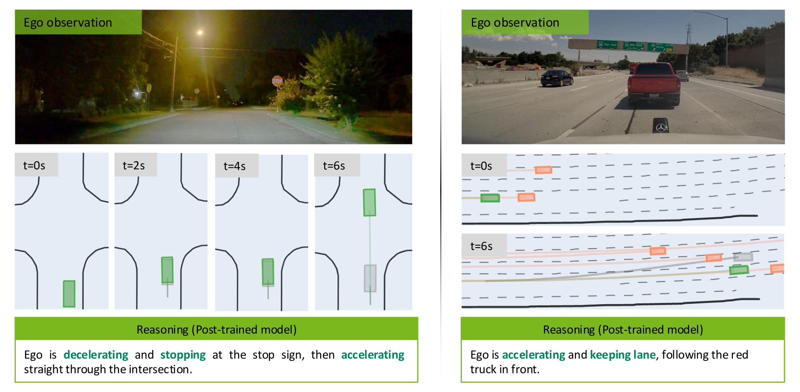

**Figure 11:** reasoning-action consistency reward를 사용한 post-training은 motion fidelity를 개선한다. 회색 motion은 SFT-pretrained base model의 most-likely rollout을, 녹색 motion은 post-trained model의 most-likely rollout을 나타낸다. 주황색 motion은 obstacle의 motion replay를 나타낸다. 왼쪽: base model(회색)은 reasoning trace가 stop 후 ego vehicle이 accelerate해야 한다고 올바르게 지시함에도 중간에 stop하고 motion을 resume하지 못한다. post-trained model(녹색)은 decelerate, stop, intersection clear 후 accelerate라는 전체 causal sequence를 실행한다. 오른쪽: reasoning이 ego vehicle에게 lead vehicle을 follow하라고 지시할 때, post-trained model의 generated motion은 reasoning trace(“accelerating and keeping lane”)에 따라 적절한 speed와 lane position을 유지하지만, base model의 generated motion은 lane을 바꾸어 intended plan에서 drift한다.

**Safety Reward 부과의 가치.** reasoning과 consistency reward는 interpretability와 causal grounding을 개선하지만, safe motion trajectory 생성을 명시적으로 constrain하지는 않는다. physical safety를 보장하기 위해 우리는 post-training 중 unsafe하거나 physically implausible한 trajectory를 penalize하는 safety reward를 도입한다. 실험적으로 safety reward를 추가하면 reasoning quality를 손상하지 않고 close encounter rate를 더 줄이고 trajectory generation을 안정화한다. Tab. 9에 나타난 것처럼 full reward configuration은 ADE와 reasoning-action consistency 개선을 유지하면서 가장 낮은 close encounter rate를 달성한다.

### 6.4. Ablation: VLM Backbone Selection

VLM backbone 선택은 Alpamayo-R1 성능에 중요하다. 이 섹션에서는 두 가지 상호 보완적 측면, model scale의 영향과 Physical-AI-focused pre-training의 이점을 조사한다. 이 ablation은 model capacity와 domain-relevant pre-training이 모두 강한 driving performance에 필수적임을 보여준다.

#### 6.4.1. Model Size Ablation

model capacity가 driving performance에 미치는 영향을 조사하기 위해, 먼저 general-purpose VLM을 사용한 baseline scaling experiment를 수행한다. 구체적으로 backbone size가 서로 다른 세 architecture variant, 즉 0.5B, 3B, 7B parameter를 평가한다. 0.5B model은 DINOv2(Oquab et al., 2023) vision encoder와 Qwen2.5-0.5B(Qwen Team, 2024) language model을 결합하고, 3B와 7B model은 각각 Qwen2.5-VL-3B(Bai et al., 2025)와 Qwen2.5-VL-7B(Bai et al., 2025)를 활용한다. 이 ablation study에서 모든 variant는 main model보다 reduced training budget으로 동일한 data에 학습되며, route information 없이 `D_overall` held-out test set에서 6 s horizon의 minADE6 metric으로 평가된다.

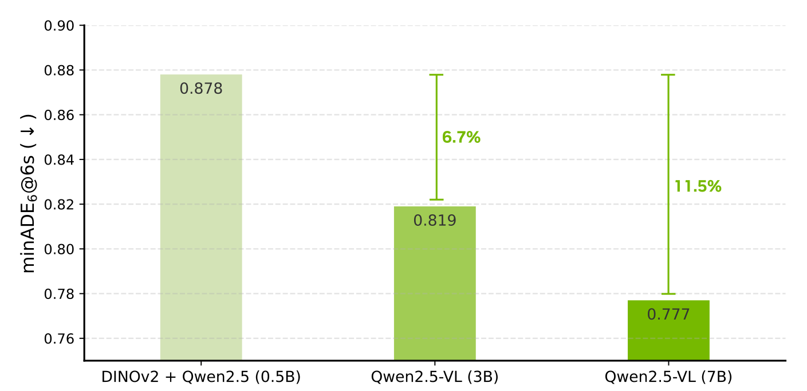

**Figure 12:** VLM backbone size가 open-loop driving performance에 미치는 영향. 모든 model은 동일한 training data와 hyperparameter로 `D_overall`에서 평가된다.

Fig. 12에 나타난 것처럼 model size가 증가함에 따라 open-loop performance가 일관되게 개선되는 것을 관찰한다. 7B model은 0.5B baseline 대비 minADE6를 11% 줄여, vision-language backbone scaling이 더 나은 scene understanding과 trajectory prediction을 가능하게 함을 입증한다. 이 결과는 model capacity의 중요성을 확인하지만, domain-specific pre-training이 없는 general-purpose VLM에 기반한다. Sec. 6.4.3에서 보이듯, Physical AI-focused pre-training(Cosmos-Reason, Sec. 6.4.3)을 통합하면 추가로 큰 개선이 생기며, 이것이 최종 Alpamayo-R1 model이 Cosmos-Reason을 backbone으로 채택하는 이유다.

#### 6.4.2. Data Scaling

model scaling을 보완하여, model architecture와 training budget이 고정될 때 training data scale이 driving performance에 미치는 영향을 조사한다. 0.5B model을 100k, 200k, 500k, 1M, 2M video segment라는 서로 다른 양의 data로 학습하고, 모든 experiment에서 총 training step 수는 고정한다.

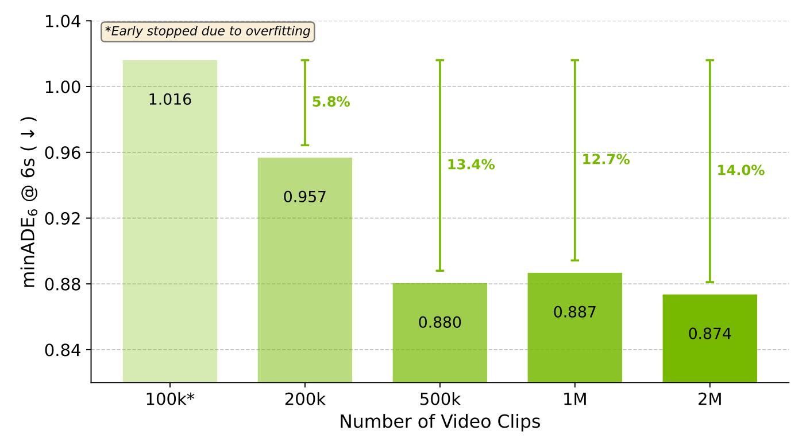

**Figure 13:** training data scale이 open-loop driving performance에 미치는 영향. 모든 model은 동일한 hyperparameter와 고정된 총 training step을 사용하는 0.5B architecture를 사용한다. model은 `D_overall` held-out test set에서 평가된다. `*`는 overfitting 때문에 early stopped되었음을 의미한다.

Fig. 13에서 보듯 data scale이 증가할수록 performance가 일관되게 개선되어 autonomous driving에서 data diversity의 가치를 보여준다. 100k model은 명확한 overfitting을 보인다(early stopping 없이 1.111m, early stopping 적용 시 1.016m). 500k로 확장하면 0.880m(100k 대비 13.4% improvement)를 달성하고, 2M은 0.874m(14.0% improvement)로 best performance를 달성한다. 이 결과는 이전 subsection의 model size ablation과 함께 model capacity와 data scale이 driving performance 개선을 위한 효과적 차원이며, robust autonomous driving system 달성에서 상호 보완적 역할을 함을 보여준다.

#### 6.4.3. Cosmos-Reason Physical AI Capabilities

위 scaling experiment는 model capacity의 중요성을 보여주지만, fixed model size에서 domain-specific pre-training이 중요한지라는 critical question에는 답하지 않는다. Sec. 3에서 설명했듯 Alpamayo-R1은 driving scenario를 포함한 Physical AI data로 specifically post-trained된 Cosmos-Reason(NVIDIA et al., 2025)을 VLM backbone으로 채택한다. 이 architectural choice를 검증하고 Physical-AI-focused pre-training이 scale만으로 얻는 것 이상의 driving-specific understanding을 향상시킴을 입증하기 위해, public driving benchmark에서 Cosmos-Reason을 comparable 7B-scale general-purpose VLM과 비교한다.

**LingoQA Benchmark.** Tab. 10은 driving scene understanding에 대한 vision-language model을 평가하는 LingoQA benchmark(Marcu et al., 2024)의 zero-shot evaluation result를 제시한다. 우리의 Cosmos-Reason-7B model은 66.2% accuracy를 달성하여 GPT-4V(59.6%), Qwen2-VL-7B(52.6%), Qwen2.5-VL-7B(62.2%), InternVL3.5-8B(58.6%), DeepSeek-VL-7B(46.4%)를 포함한 여러 VLM을 능가한다. baseline 대비 이 개선은 Physical-AI-focused SFT가 autonomous driving context의 scene understanding capability를 크게 향상시킴을 보여주며, Fig. 12에서 보인 model scaling의 이점을 보완한다.

**Table 10:** LingoQA benchmark(Marcu et al., 2024)에서 다양한 VLM의 zero-shot accuracy. 우리의 Cosmos-Reason-7B model은 모든 baseline을 능가한다.

| Model | GPT-4V | Qwen2-VL-7B | Qwen2.5-VL-7B | InternVL3.5-8B | DeepSeek-VL-7B | Ours |
| --- | --- | --- | --- | --- | --- | --- |
| Lingo-Judge | 59.6 | 52.6 | 62.2 | 58.6 | 46.4 | 66.2 |

이 결과는 model capacity와 domain-specific pre-training이 모두 강한 driving performance에 필수적임을 확인한다. 이는 Alpamayo-R1의 backbone으로 Cosmos-Reason을 선택한 동기를 제공하며, general-purpose VLM이 갖지 못할 수 있는 Physical AI capability를 갖춘 강한 기반을 제공한다.

### 6.5. Ablation: Action Modality Injection

Tab. 11에서 우리는 flow matching을 사용하는 unicycle dynamics 기반 continuous action representation 채택의 효과를 입증한다. 구체적으로 6 discrete trajectory token을 autoregressive하게 예측하도록 학습한 baseline model과, 동일 size와 training data를 사용하지만 flow matching으로 trajectory를 decode하는 model을 비교한다. baseline autoregressive model의 discrete trajectory tokenizer는 VQGAN(Esser et al., 2021)으로 pre-trained되었으며, reconstruction error를 낮게 유지하면서 output discrete token 수를 최소화하여 autoregressive decoding latency를 줄인다. inference 중에는 flow matching에서 `δt = 0.2`, 즉 5 step으로 설정하여 negligible performance degradation으로 latency를 줄인다. Tab. 11에 나타난 것처럼, flow-matching을 통해 dynamically governed continuous action space를 활용하면 open-loop 및 closed-loop metric 모두에서 상당한 개선을 얻고 comfort를 향상시키며 더 빠른 inference speed를 달성한다.

**Table 11:** trajectory decoding strategy 비교. model은 route signal과 함께 학습 및 평가된다. 평가는 overall gain을 보여주기 위해 `D_overall`에서 수행된다. Comfort(Accel) metric은 predicted trajectory 중 comfort range에 있는 비율을 측정한다.

| Strategy | minADE6 @6s ↓ | AlpaSim Score (at fault) ↑ | Comfort (Accel) ↑ | Rel. Decode Speed↑ |
| --- | --- | --- | --- | --- |
| Auto-Regressive | 0.6811 | 0.59 ± 0.17 | 44.05% | 1.00× |
| Flow Matching | 0.6440 | 1.27 ± 0.34 | 97.38% | 1.16× |

### 6.6. Ablation: Efficient Vision Encoding

Sec. 3.2.1에서 논의했듯, multi-camera video input을 표현하는 데 필요한 token 측면에서 default single-image tokenizer보다 더 efficient할 수 있는 alternative vision encoding method가 존재한다. 접근법을 비교하기 위해 4-camera setup을 선택하고, vision encoder를 바꾸며, resulting end-to-end model의 open-loop driving quality를 baseline 대비 minADE6로 비교한다.

Tab. 12에서 볼 수 있듯, Ivanovic et al. (2025)의 triplane-based multi-camera tokenizer는 6.3M parameter만 추가하고 sensor token count를 3.6× 줄이면서 baseline과 거의 동일한 minADE6 value를 달성한다. Flex(Yang et al., 2025)는 더 과감한 개선을 달성할 수 있으며, 전체 driving model에 61.6M parameter만 추가하면서 최대 20× token compression을 얻고 baseline의 driving quality와 일치한다.

AR1은 기본적으로 single-image tokenization을 채택한다. optimal strategy는 camera 수, temporal frame 수, camera resolution에 따라 달라질 수 있기 때문이다. 예를 들어 소수의 camera와 짧은 history는 single-image tokenization에 유리하고, 더 많은 camera와 짧은 history는 triplane(Ivanovic et al., 2025)에 유리하며, 더 많은 camera와 긴 history sequence는 Flex(Yang et al., 2025)에 유리하다.

**Table 12:** `D_overall`에서 efficient vision encoding strategy의 relative comparison.

| Model | Added Parameters ↓ | Tokens per Image ↓ | Rel. minADE6 ↓ |
| --- | --- | --- | --- |
| Baseline | 0 | 160 (1.0×) | 0% |
| Triplane (Ivanovic et al., 2025) | 6.3M | 104 (1.5×) | -3% |
| Triplane (Ivanovic et al., 2025) | 6.3M | 45 (3.6×) | +4% |
| Flex (Yang et al., 2025) | 61.6M | 50 (3.2×) | -3% |
| Flex (Yang et al., 2025) | 61.6M | 32 (5.0×) | -3% |
| Flex (Yang et al., 2025) | 61.6M | 16 (10×) | -2% |
| Flex (Yang et al., 2025) | 61.6M | 8 (20×) | -2% |

**Table 13:** NVIDIA RTX 6000 Pro Blackwell에서 inference runtime breakdown. Alpamayo-R1은 flow-matching-based trajectory decoding과 efficient vision encoding을 결합하여 real-time performance(99ms)를 달성한다.

| Model Configuration | Vision Encoder | Prefilling | Reasoning Decoding | Trajectory Decoding | Total |
| --- | --- | --- | --- | --- | --- |
| Baseline (trajectory-only, flow matching) | 3.43ms | 16.54ms | - | 8.75ms (5 steps) | 29ms |
| Alpamayo-R1 (ours, flow matching) | 3.43ms | 16.54ms | 70ms (40 tokens) | 8.75ms (5 steps) | 99ms |
| Alpamayo-R1 (auto-regressive traj) | 3.43ms | 16.54ms | 70ms (40 tokens) | 222ms (127 tokens) | 312ms |

### 6.7. On-Vehicle Road Tests

AR1의 real-world deployment capability를 검증하기 위해, 우리는 test vehicle에 model을 배포하고 urban driving environment에서 road testing을 수행했다. vehicle은 human intervention 없이 complex urban scenario를 성공적으로 navigate하여, simulation을 넘어 real-world driving condition을 처리하는 model ability를 입증했다. Fig. 14는 AR1이 traffic situation을 정확히 식별하고 appropriate driving action으로 이어지는 clear and concise reasoning trace를 생성하는 intersection을 보여준다. 이 test는 simulation improvement가 real-world autonomous driving scenario로 성공적으로 transfer됨을 확인한다.

**Real-Time Inference Performance.** on-vehicle deployment의 critical requirement는 real-time inference capability다. 우리는 NVIDIA RTX 6000 Pro Blackwell platform에서 AR1을 benchmark했고, autonomous driving의 real-time requirement(일반적으로 100ms) 내인 99ms end-to-end inference latency를 달성했다. Tab. 13은 inference pipeline의 상세 breakdown을 제공하며, 우리의 접근법을 alternative design choice와 비교한다. prefilling stage는 visual token과 route information을 transformer layer로 처리하여 key-value cache를 생성하고, 이는 reasoning과 trajectory decoding 모두에서 사용된다.

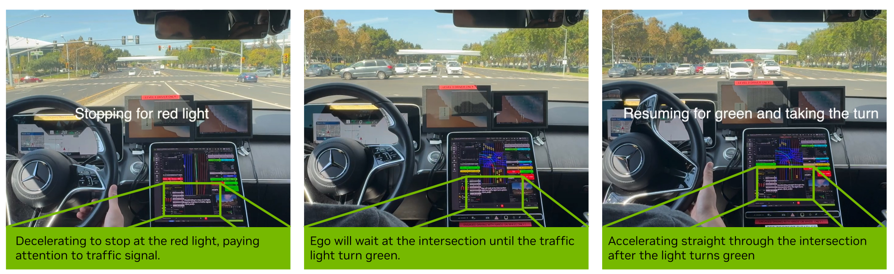

**Figure 14:** intersection scenario에서 AR1이 reasoning trace를 생성하는 on-vehicle road test. ego vehicle은 먼저 red light 때문에 decelerate하여 stop하고, traffic signal을 기다린 뒤 light가 green으로 바뀌면 resume하여 turn을 수행한다.

## 7. 결론

본 연구에서 우리는 structured chain-of-thought reasoning capability와 trajectory prediction을 통합하여 특히 long-tail, safety-critical scenario에서 autonomous driving performance를 향상시키는 vision-language-action model Alpamayo-R1(AR1)을 제시했다. 모델이 causally-grounded reasoning을 생성하도록 하기 위해, large-scale auto-labeling과 humans in the loop을 결합한 hybrid labeling pipeline으로 구축한 Chain of Causation(CoC) dataset을 도입했다. 또한 RL을 통해 reasoning을 action과 정렬하여 generated reasoning trace가 executed driving behavior와 일관되도록 했다. open-loop metric, closed-loop simulation, ablation study 전반의 포괄적 평가는 AR1이 end-to-end baseline 대비 일관된 개선을 달성하며, 복잡한 agent interaction이 포함된 challenging scenario에서 특히 두드러진 이득을 보임을 입증한다.

**Future Work.** 현재 평가는 internal dataset과 LingoQA benchmark에 초점을 두지만, 우리는 autonomous driving planning 및 decision-making을 위한 추가 public benchmark로 평가를 확장할 계획이다. 이는 다양한 evaluation protocol 전반에서 Alpamayo-R1의 capability를 더 포괄적으로 이해하고, community의 다른 state-of-the-art method와 직접 비교할 수 있게 할 것이다. 더 넓게는 몇 가지 유망한 연구 방향이 남아 있다. 첫째, policy structuring: flow-matching-based trajectory decoder가 kinematically feasible output을 제공하지만, high-level meta-action을 structured motion primitive로 분해하는 hierarchical policy architecture를 탐색하면 interpretability와 efficiency를 더 개선할 수 있다. 둘째, reasoning on demand: 현재 architecture는 모든 input에 대해 reasoning trace를 생성한다. future work는 safety-critical 또는 ambiguous scenario에서만 reasoning을 선택적으로 호출하는 adaptive mechanism을 조사하여 test-time scaling의 최근 발전(Yao et al., 2023; OpenAI, 2024)과 유사하게 더 효율적인 inference-time compute allocation을 가능하게 할 수 있다. 셋째, auxiliary task integration: AR1은 trajectory prediction과 causal reasoning에 초점을 두지만, depth estimation, scene flow prediction, 3D Gaussian Splatting representation 같은 complementary self-supervised objective를 통합하면 visual backbone의 semantic understanding을 개선할 수 있다. 넷째, world model integration: 현재 접근법은 observed state에서 action을 예측한다. learned world model을 통합하면 forward simulation과 counterfactual reasoning을 가능하게 하여 dynamic scenario에서 robustness를 개선할 수 있다.

**Open Source Release.** 우리는 language-based reasoning과 autonomous driving의 교차점 연구를 진전시키기 위해, NVIDIA의 Hugging Face webpage에서 제공되는 sensor data 및 label을 보강하는 CoC dataset 일부와 함께 Alpamayo-R1 model을 Hugging Face에 공개할 계획이다.

## A. 기여자 및 감사의 글

### A.1. Core Contributors

Yulong Cao, Tong Che, Yuxiao Chen, Wenhao Ding, Boris Ivanovic, Peter Karkus, Boyi Li, Tsung-Yi Lin, Patrick Langechuan Liu, Zhijian Liu, Jason Lu, Wenjie Luo, Marco Pavone, Ran Tian, Yan Wang, Xinshuo Weng, Tianjun Xiao, Xiaodong Yang, Yurong You, Xiaohui Zeng.

**Data & Benchmarks:** TX, XW, YC, WD, YW가 autonomous driving dataset과 benchmark를 curate했다.

**Labeling Pipeline:** XW, YC, WD, BL, XY, YW가 reasoning trace labeling pipeline과 infrastructure를 개발했다.

**Training Infrastructure:** YY, WL, YW, WD가 supervised fine-tuning infrastructure를 구축했고, TC, RT, WL이 reinforcement learning infrastructure를 구축했다.

**Vision Encoding:** BI, YW가 vision encoder를 개발했다.

**Action Decoding:** YY, YC가 flow-matching trajectory decoder를 구축했다.

**Model Training:** YY, WL, YW, WD, JL, ZL, PLL은 supervised fine-tuning으로 VLA model을 학습했다. YW, WL, YY, XY, TL, XZ는 Cosmos-Reason VLM backbone을 학습했다. RT, TC, YW, WL, YY, WD는 post-training strategy를 설계하고 reinforcement learning으로 model을 post-train했다. WD, YC는 data mixture strategy를 설계했다.

**Project Leads:** YW, WL은 concept부터 completion까지 project를 이끌었다.

**Program Architect and Project Manager:** MP는 전체 effort를 구상하고 조율하며 guide했다. BI는 coordination과 guidance에서 MP를 지원했다.

### A.2. Contributors

Junjie Bai, Ke Chen, Jenna Diamond, Yifan Ding, Liang Feng, Greg Heinrich, Jack Huang, Pinyi Li, Dongran Liu, Ming-Yu Liu, Leo Yunxiang Mao, Pavlo Molchanov, Lindsey Pavao, Zhenghao Peng, Mike Ranzinger, Ed Schmerling, Shida Shen, Yunfei Shi, Sarah Tariq, Tilman Wekel, Eric Yang, Wenyuan Zhang.

**Contributions.** ST는 production side의 end-to-end development를 이끌었고 data pipeline과 model architecture에 핵심 input을 제공했다. LP, JD는 human annotation effort를 이끌었다. PM, GH, MR은 vision encoder를 학습했다. ML은 Cosmos-Reason model support를 제공했다. YD는 cosmos AV data를 training format으로 처리했다. ZP는 large-scale SFT training workflow를 개선했다. FL, JB는 large-scale RL training infrastructure를 지원했다. ES는 driving data를 curate하고 preprocess했다. KC, WZ, JH는 CoC auto-labeling pipeline을 개선했다. SS는 CoC reasoning trace를 위한 LLM-based evaluator를 개발했다. YS, EY, TW는 human labeling용 CoC labeling tool을 구축했다. DL, PL, LM은 on-vehicle test와 model profiling 수행에 중요한 역할을 했다.

### A.3. 감사의 글

우리는 leadership과 strategic support를 제공한 Xinzhou Wu와 Ali Kani에게 감사한다. AV model training과 deployment 전반을 지원한 Sachin Patil, vision-language model training에 관해 유익한 논의를 제공한 Zhiding Yu, Guilin Liu, Max Li, Song Han, Hongxu Yin, Sifei Liu, Yu-Wei Chao에게 감사한다. CoC labeling pipeline을 실행한 Jesse Hong, CoC auto-labeling pipeline 개선에 기여한 Richard Lin, Zi Wang, Walter Yu, CoC human labeling pipeline 개선에 기여한 Anton Mitrokhin, Jacob Kern에게 감사한다. dataset management와 release를 담당한 Martin Peng, Steve Hu, Andy Martin, model deployment를 지원한 Di Chen, Hanson Xu, on-vehicle deployment support를 제공한 Chao Fang, Shuaijun Chen, Niral Pathak에게 감사한다. onboard vehicle deployment를 도운 Charles Vorbach, Zhenyi Zhang, Rachit Shah, Ritaank Tiwari, vehicle testing을 수행한 Parixit Aghera, Ratin Kumar, Parag Mehendale, Niranjan Avadhanam, Rajath Shetty, Ronan LeToquin, Suraj Das, Ashley Hu에게 감사한다. closed-loop simulation support를 제공한 Sachit Kadle, Annie Feng, Zheng Lian, 그리고 closed-loop experimentation과 metric implementation을 수행한 Maximilian Igl, Michael Watson, Apoorva Sharma에게 감사한다.

## References

참고문헌 항목은 원문 표기를 유지한다.

[1] Josh Achiam, Steven Adler, Sandhini Agarwal, Lama Ahmad, Ilge Akkaya, Florencia Leoni Aleman, Diogo Almeida, Janko Altenschmidt, Sam Altman, Shyamal Anadkat, et al. GPT-4 technical report. arXiv preprint arXiv:2303.08774, 2023.

[2] Hidehisa Arai, Keita Miwa, Kento Sasaki, Kohei Watanabe, Yu Yamaguchi, Shunsuke Aoki, and Issei Yamamoto. CoVLA: Comprehensive vision-language-action dataset for autonomous driving. In 2025 IEEE/CVF Winter Conference on Applications of Computer Vision (WACV), pages 1933-1943. IEEE, 2025.

[3] Shuai Bai, Keqin Chen, Xuejing Liu, Jialin Wang, Wenbin Ge, Sibo Song, Kai Dang, Peng Wang, Shijie Wang, Jun Tang, et al. Qwen2.5-VL technical report. arXiv preprint arXiv:2502.13923, 2025.

[4] Yuntao Bai, Saurav Kadavath, Sandipan Kundu, Amanda Askell, Jackson Kernion, Andy Jones, Anna Chen, Anna Goldie, Azalia Mirhoseini, Cameron McKinnon, et al. Constitutional AI: Harmlessness from AI feedback. arXiv preprint arXiv:2212.08073, 2022.

[5] Satanjeev Banerjee and Alon Lavie. METEOR: An automatic metric for mt evaluation with improved correlation with human judgments. In ACL Workshop on Intrinsic and Extrinsic Evaluation Measures for Machine Translation and/or Summarization, pages 65-72, 2005.

[6] Mariusz Bojarski, Davide Del Testa, Daniel Dworakowski, Bernhard Firner, Beat Flepp, Prasoon Goyal, Lawrence D. Jackel, Mathew Monfort, Urs Muller, Jiakai Zhang, et al. End-to-End Learning for Self-Driving Cars. arXiv preprint arXiv:1604.07316, 2016.

[7] Holger Caesar, Varun Bankiti, Alex H Lang, Sourabh Vora, Venice Erin Liong, Qiang Xu, Anush Krishnan, Yu Pan, Giancarlo Baldan, and Oscar Beijbom. nuScenes: A multimodal dataset for autonomous driving. In IEEE/CVF Conference on Computer Vision and Pattern Recognition, pages 11621-11631, 2020.

[8] Haohan Chi, Huan-ang Gao, Ziming Liu, Jianing Liu, Chenyu Liu, Jinwei Li, Kaisen Yang, Yangcheng Yu, Zeda Wang, Wenyi Li, et al. Impromptu VLA: Open weights and open data for driving vision-language-action models. arXiv preprint arXiv:2505.23757, 2025.

[9] Jang Hyun Cho, Boris Ivanovic, Yulong Cao, Edward Schmerling, Yue Wang, Xinshuo Weng, Boyi Li, Yurong You, Philipp Krähenbühl, Yan Wang, et al. Language-image models with 3D understanding. In International Conference on Learning Representations, 2025.

[10] Paul F Christiano, Jan Leike, Tom Brown, Miljan Martic, Shane Legg, and Dario Amodei. Deep reinforcement learning from human preferences. Advances in Neural Information Processing Systems, 2017.

[11] Gheorghe Comanici, Eric Bieber, Mike Schaekermann, Ice Pasupat, Noveen Sachdeva, Inderjit Dhillon, Marcel Blistein, Ori Ram, Dan Zhang, Evan Rosen, et al. Gemini 2.5: Pushing the frontier with advanced reasoning, multimodality, long context, and next generation agentic capabilities. arXiv preprint arXiv:2507.06261, 2025.

[12] Charles Corbière, Simon Roburin, Syrielle Montariol, Antoine Bosselut, and Alexandre Alahi. Retrieval-based interleaved visual chain-of-thought in real-world driving scenarios. arXiv preprint arXiv:2501.04671, 2025.

[13] Daniel Dauner, Marcel Hallgarten, Andreas Geiger, and Kashyap Chitta. Parting with misconceptions about learning-based vehicle motion planning. In Conference on Robot Learning, pages 1268-1281. PMLR, 2023.

[14] DeepSeek-AI. DeepSeek-R1: Incentivizing reasoning capability in LLMs via reinforcement learning. arXiv preprint arXiv:2501.12948, 2025.

[15] Xinpeng Ding, Jianhua Han, Hang Xu, Xiaodan Liang, Wei Zhang, and Xiaomeng Li. Holistic autonomous driving understanding by bird’s-eye-view injected multi-modal large models. In IEEE/CVF Conference on Computer Vision and Pattern Recognition, pages 13668-13677, 2024.

[16] Alexey Dosovitskiy, German Ros, Felipe Codevilla, Antonio Lopez, and Vladlen Koltun. CARLA: An open urban driving simulator. In Conference on Robot Learning. PMLR, 2017.

[17] Alexey Dosovitskiy, Lucas Beyer, Alexander Kolesnikov, Dirk Weissenborn, Xiaohua Zhai, Thomas Unterthiner, Mostafa Dehghani, Matthias Minderer, Georg Heigold, Sylvain Gelly, Jakob Uszkoreit, and Neil Houlsby. An image is worth 16x16 words: Transformers for image recognition at scale. In International Conference on Learning Representations, 2020.

[18] Danny Driess, Jost Tobias Springenberg, Brian Ichter, Lili Yu, Adrian Li-Bell, Karl Pertsch, Allen Z Ren, Homer Walke, Quan Vuong, Lucy Xiaoyang Shi, et al. Knowledge insulating vision-language-action models: Train fast, run fast, generalize better. arXiv preprint arXiv:2505.23705, 2025.

[19] Patrick Esser, Robin Rombach, and Bjorn Ommer. Taming transformers for high-resolution image synthesis. In IEEE/CVF Conference on Computer Vision and Pattern Recognition, pages 12873-12883, 2021.

[20] Scott Ettinger, Shuyang Cheng, Benjamin Caine, Chenxi Liu, Hang Zhao, Sabeek Pradhan, Yuning Chai, Ben Sapp, Charles Qi, Yin Zhou, Zoey Yang, Aurélien Chouard, Pei Sun, Jiquan Ngiam, Vijay Vasudevan, Alexander McCauley, Jonathon Shlens, and Dragomir Anguelov. Large scale interactive motion forecasting for autonomous driving: The waymo open motion dataset. In IEEE International Conference on Computer Vision, 2021.

[21] Shiyu Fang, Yiming Cui, Haoyang Liang, Chen Lv, Peng Hang, and Jian Sun. CoReVLA: A dual-stage end-to-end autonomous driving framework for long-tail scenarios via collect-and-refine. arXiv preprint arXiv:2509.15968, 2025.

[22] Jiayuan Gu, Jiageng Chen, Yiming Liu, Hang Zhao, Yu Qiao, and Jifeng Dai. VAD: End-to-end video driving. In IEEE/CVF International Conference on Computer Vision, pages 5073-5083, 2023.

[23] Yuhan Hao, Zhengning Li, Lei Sun, Weilong Wang, Naixin Yi, Sheng Song, Caihong Qin, Mofan Zhou, Yifei Zhan, Peng Jia, et al. DriveAction: A benchmark for exploring human-like driving decisions in vla models. arXiv preprint arXiv:2506.05667, 2025.

[24] Deepti Hegde, Rajeev Yasarla, Hong Cai, Shizhong Han, Apratim Bhattacharyya, Shweta Mahajan, Litian Liu, Risheek Garrepalli, Vishal M Patel, and Fatih Porikli. Distilling multi-modal large language models for autonomous driving. In IEEE/CVF Conference on Computer Vision and Pattern Recognition, pages 27575-27585, 2025.

[25] Xinmeng Hou, Wuqi Wang, Long Yang, Hao Lin, Jinglun Feng, Haigen Min, and Xiangmo Zhao. DriveAgent: Multi-agent structured reasoning with LLM and multimodal sensor fusion for autonomous driving. arXiv preprint arXiv:2505.02123, 2025.

[26] Hanxue Hu, Ye Yuan, Hongyang Xu, Zhaoyang Chen, Ming Liang, Zhiding Li, Yuexin Ma, Xiaodong Shen, Yuning Chai, Xiaoqing Tan, et al. UniAD: Unified perception and prediction for autonomous driving. In IEEE/CVF Conference on Computer Vision and Pattern Recognition, 2023.

[27] Jyh-Jing Hwang, Runsheng Xu, Hubert Lin, Wei-Chih Hung, Jingwei Ji, Kristy Choi, Di Huang, Tong He, Paul Covington, Benjamin Sapp, et al. EMMA: End-to-end multimodal model for autonomous driving. arXiv preprint arXiv:2410.23262, 2024.

[28] Ayesha Ishaq, Jean Lahoud, Ketan More, Omkar Thawakar, Ritesh Thawkar, Dinura Dissanayake, Noor Ahsan, Yuhao Li, Fahad Shahbaz Khan, Hisham Cholakkal, et al. DriveLMM-o1: A step-by-step reasoning dataset and large multimodal model for driving scenario understanding. arXiv preprint arXiv:2503.10621, 2025.

[29] Boris Ivanovic, Cristiano Saltori, Yurong You, Yan Wang, Wenjie Luo, and Marco Pavone. Efficient multi-camera tokenization with triplanes for end-to-end driving. IEEE Robotics and Automation Letters, 10(11):11713-11720, 2025.

[30] Michael Janner, Yilun Du, Joshua Tenenbaum, and Sergey Levine. Planning with diffusion for flexible behavior synthesis. In International Conference on Machine Learning, pages 9902-9915, 2022.

[31] Xiaosong Jia, Zhenjie Yang, Qifeng Li, Zhiyuan Zhang, and Junchi Yan. Bench2Drive: Towards multi-ability benchmarking of closed-loop end-to-end autonomous driving. Advances in Neural Information Processing Systems, 37:819-844, 2024.

[32] Anqing Jiang, Yu Gao, Yiru Wang, Zhigang Sun, Shuo Wang, Yuwen Heng, Hao Sun, Shichen Tang, Lijuan Zhu, Jinhao Chai, et al. IRL-VLA: Training an vision-language-action policy via reward world model. arXiv preprint arXiv:2508.06571, 2025.

[33] Bo Jiang, Shaoyu Chen, Bencheng Liao, Xingyu Zhang, Wei Yin, Qian Zhang, Chang Huang, Wenyu Liu, and Xinggang Wang. Senna: Bridging large vision-language models and end-to-end autonomous driving. arXiv preprint arXiv:2410.22313, 2024.

[34] Chiyu Jiang, Andre Cornman, Cheolho Park, Benjamin Sapp, Yin Zhou, Dragomir Anguelov, et al. MotionDiffuser: Controllable multi-agent motion prediction using diffusion. In IEEE/CVF Conference on Computer Vision and Pattern Recognition, pages 9644-9653, 2023.

[35] Jared Kaplan, Sam McCandlish, Tom Henighan, Tom B Brown, Benjamin Chess, Rewon Child, Scott Gray, Alec Radford, Jeffrey Wu, and Dario Amodei. Scaling laws for neural language models. arXiv preprint arXiv:2001.08361, 2020.

[36] Samir Khaki, Junxian Guo, Jiaming Tang, Shang Yang, Yukang Chen, Konstantinos N. Plataniotis, Yao Lu, Song Han, and Zhijian Liu. SparseVILA: Decoupling Visual Sparsity for Efficient VLM Inference. In ICCV, 2025.

[37] Jinkyu Kim, Anna Rohrbach, Trevor Darrell, John Canny, and Zeynep Akata. Textual explanations for self-driving vehicles. In European Conference on Computer Vision, pages 563-578, 2018.

[38] Woosuk Kwon, Zhuohan Li, Siyuan Zhuang, Ying Sheng, Lianmin Zheng, Cody Hao Yu, Joseph E. Gonzalez, Hao Zhang, and Ion Stoica. Efficient memory management for large language model serving with pagedattention. In ACM SIGOPS 29th Symposium on Operating Systems Principles, 2023.

[39] Harrison Lee, Samrat Phatale, Hassan Mansoor, Thomas Mesnard, Johan Ferret, Kellie Ren Lu, Colton Bishop, Ethan Hall, Victor Carbune, Abhinav Rastogi, et al. RLAIF vs. RLHF: Scaling Reinforcement Learning from Human Feedback with AI Feedback. In International Conference on Machine Learning, 2023.

[40] Kimin Lee, Hao Liu, Moonkyung Ryu, Olivia Watkins, Yuqing Du, Craig Boutilier, Pieter Abbeel, Mohammad Ghavamzadeh, and Shixiang Shane Gu. Aligning text-to-image models using human feedback. arXiv preprint arXiv:2302.12192, 2023.

[41] Sébastien Lefèvre, David Vasquez, and Christian Laugier. A survey on motion prediction and risk assessment for intelligent vehicles. ROBOMECH Journal, 1(1):1-14, 2014.

[42] Boyi Li, Ligeng Zhu, Ran Tian, Shuhan Tan, Yuxiao Chen, Yao Lu, Yin Cui, Sushant Veer, Max Ehrlich, Jonah Philion, et al. Wolf: Dense video captioning with a world summarization framework. Transactions on Machine Learning Research, 2025.

[43] Yiheng Li, Cunxin Fan, Chongjian Ge, Zhihao Zhao, Chenran Li, Chenfeng Xu, Huaxiu Yao, Masayoshi Tomizuka, Bolei Zhou, Chen Tang, et al. WOMD-Reasoning: A large-scale dataset for interaction reasoning in driving. arXiv preprint arXiv:2407.04281, 2024.

[44] Yongkang Li, Kaixin Xiong, Xiangyu Guo, Fang Li, Sixu Yan, Gangwei Xu, Lijun Zhou, Long Chen, Haiyang Sun, Bing Wang, et al. ReCogDrive: A reinforced cognitive framework for end-to-end autonomous driving. arXiv preprint arXiv:2506.08052, 2025.

[45] Yue Li, Meng Tian, Dechang Zhu, Jiangtong Zhu, Zhenyu Lin, Zhiwei Xiong, and Xinhai Zhao. Drive-R1: Bridging reasoning and planning in VLMs for autonomous driving with reinforcement learning. arXiv preprint arXiv:2506.18234, 2025.

[46] Haicheng Liao, Hanlin Kong, Bonan Wang, Chengyue Wang, Wang Ye, Zhengbing He, Chengzhong Xu, and Zhenning Li. CoT-Drive: Efficient motion forecasting for autonomous driving with LLMs and chain-of-thought prompting. IEEE Transactions on Artificial Intelligence, 2025.

[47] Yaron Lipman, Ricky T. Q. Chen, Heli Ben-Hamu, Maximilian Nickel, and Matthew Le. Flow matching for generative modeling. In International Conference on Learning Representations, 2023.

[48] Wenru Liu, Pei Liu, and Jun Ma. DSDrive: Distilling large language model for lightweight end-to-end autonomous driving with unified reasoning and planning. arXiv preprint arXiv:2505.05360, 2025.

[49] Xueyi Liu, Zuodong Zhong, Yuxin Guo, Yun-Fu Liu, Zhiguo Su, Qichao Zhang, Junli Wang, Yinfeng Gao, Yupeng Zheng, Qiao Lin, et al. ReasonPlan: Unified scene prediction and decision reasoning for closed-loop autonomous driving. arXiv preprint arXiv:2505.20024, 2025.

[50] Yiren Lu, Justin Fu, George Tucker, Xinlei Pan, Eli Bronstein, Rebecca Roelofs, Benjamin Sapp, Brandyn White, Aleksandra Faust, Shimon Whiteson, et al. Imitation is not enough: Robustifying imitation with reinforcement learning for challenging driving scenarios. In IEEE/RSJ International Conference on Intelligent Robots and Systems, pages 7553-7560, 2023.

[51] Yuhang Lu, Jiadong Tu, Yuexin Ma, and Xinge Zhu. ReAL-AD: Towards human-like reasoning in end-to-end autonomous driving. arXiv preprint arXiv:2507.12499, 2025.

[52] Yuechen Luo, Fang Li, Shaoqing Xu, Zhiyi Lai, Lei Yang, Qimao Chen, Ziang Luo, Zixun Xie, Shengyin Jiang, Jiaxin Liu, et al. AdaThinkDrive: Adaptive thinking via reinforcement learning for autonomous driving. arXiv preprint arXiv:2509.13769, 2025.

[53] Ziang Luo, Kangan Qian, Jiahua Wang, Yuechen Luo, Jinyu Miao, Zheng Fu, Yunlong Wang, Sicong Jiang, Zilin Huang, Yifei Hu, et al. MTRDrive: Memory-tool synergistic reasoning for robust autonomous driving in corner cases. arXiv preprint arXiv:2509.20843, 2025.

[54] Kevin M Lynch and Frank C Park. Modern Robotics. Cambridge University Press, 2017.

[55] Srikanth Malla, Chiho Choi, Isht Dwivedi, Joon Hee Choi, and Jiachen Li. DRAMA: Joint risk localization and captioning in driving. Winter Conference on Applications of Computer Vision, 2023.

[56] Jiageng Mao, Yuxi Qian, Junjie Ye, Hang Zhao, and Yue Wang. GPT-Driver: Learning to drive with GPT. arXiv preprint arXiv:2310.01415, 2023.

[57] Jiageng Mao, Junjie Ye, Yuxi Qian, Marco Pavone, and Yue Wang. A language agent for autonomous driving. In Conference on Language Modeling, 2024.

[58] Ana-Maria Marcu, Long Chen, Jan Hünermann, Alice Karnsund, Benoit Hanotte, Prajwal Chidananda, Saurabh Nair, Vijay Badrinarayanan, Alex Kendall, Jamie Shotton, et al. LingoQA: Visual question answering for autonomous driving. In European Conference on Computer Vision, pages 252-269, 2024.

[59] Tong Mu, Alec Helyar, Johannes Heidecke, Joshua Achiam, Andrea Vallone, Ian Kivlichan, Molly Lin, Alex Beutel, John Schulman, and Lilian Weng. Rule based rewards for language model safety. Advances in Neural Information Processing Systems, 2024.

[60] Ming Nie, Renyuan Peng, Chunwei Wang, Xinyue Cai, Jianhua Han, Hang Xu, and Li Zhang. Reason2Drive: Towards interpretable and chain-based reasoning for autonomous driving. In European Conference on Computer Vision, pages 292-308, 2024.

[61] NVIDIA. Cosmos-RL: A flexible and scalable reinforcement learning framework. https://nvidia-cosmos.github.io/cosmos-rl/, 2025.

[62] NVIDIA, Alisson Azzolini, Junjie Bai, Hannah Brandon, Jiaxin Cao, Prithvijit Chattopadhyay, Huayu Chen, Jinju Chu, Yin Cui, Jenna Diamond, Yifan Ding, Liang Feng, Francesco Ferroni, Rama Govindaraju, Jinwei Gu, Siddharth Gururani, Imad El Hanafi, Zekun Hao, Jacob Huffman, Jingyi Jin, Brendan Johnson, Rizwan Khan, George Kurian, Elena Lantz, Nayeon Lee, Zhaoshuo Li, Xuan Li, Maosheng Liao, Tsung-Yi Lin, Yen-Chen Lin, Ming-Yu Liu, Xiangyu Lu, Alice Luo, Andrew Mathau, Yun Ni, Lindsey Pavao, Wei Ping, David W. Romero, Misha Smelyanskiy, Shuran Song, Lyne Tchapmi, Andrew Z. Wang, Boxin Wang, Haoxiang Wang, Fangyin Wei, Jiashu Xu, Yao Xu, Dinghao Yang, Xiaodong Yang, Zhuolin Yang, Jingxu Zhang, Xiaohui Zeng, and Zhe Zhang. Cosmos-Reason1: From physical common sense to embodied reasoning, 2025. URL https://arxiv.org/abs/2503.15558.

[63] NVIDIA, Yulong Cao, Riccardo de Lutio, Sanja Fidler, Guillermo Garcia Cobo, Zan Gojcic, Maximilian Igl, Boris Ivanovic, Peter Karkus, Janick Martinez, Marco Pavone, Aaron Smith, Michal Tyszkiewicz, Michael Watson, Qi Wu, and Le Zhang. AlpaSim: A modular, lightweight, and data-driven research simulator for end-to-end autonomous driving, 2025. URL https://github.com/NVlabs/alpasim.

[64] OpenAI. Learning to reason with LLMs, 2024. URL https://openai.com/index/learning-to-reason-with-llms/.

[65] OpenAI. GPT-5 system card. https://openai.com/index/gpt-5-system-card/, 2025.

[66] Maxime Oquab, Timothée Darcet, Théo Moutakanni, Huy V Vo, Marc Szafraniec, Vasil Khalidov, Pierre Fernandez, Daniel Haziza, Francisco Massa, Alaaeldin El-Nouby, et al. DINOv2: Learning robust visual features without supervision. Transactions on Machine Learning Research, 2023.

[67] Brian Paden, Michal Čáp, Sze Zheng Yong, Dmitry Yershov, and Emilio Frazzoli. A survey of motion planning and control techniques for self-driving urban vehicles. IEEE Transactions on Intelligent Vehicles, 1(1):33-55, 2016.

[68] Kishore Papineni, Salim Roukos, Todd Ward, and Wei-Jing Zhu. BLEU: a method for automatic evaluation of machine translation. In Association for Computational Linguistics, pages 311-318, 2002.

[69] Physical Intelligence, Kevin Black, Noah Brown, James Darpinian, Karan Dhabalia, Danny Driess, Adnan Esmail, Michael Equi, Chelsea Finn, Niccolo Fusai, et al. π0.5: a vision-language-action model with open-world generalization. arXiv preprint arXiv:2504.16054, 2025.

[70] Kangan Qian, Sicong Jiang, Yang Zhong, Ziang Luo, Zilin Huang, Tianze Zhu, Kun Jiang, Mengmeng Yang, Zheng Fu, Jinyu Miao, et al. AgentThink: A unified framework for tool-augmented chain-of-thought reasoning in vision-language models for autonomous driving. arXiv preprint arXiv:2505.15298, 2025.

[71] Tianwen Qian, Jingjing Chen, Linhai Zhuo, Yang Jiao, and Yu-Gang Jiang. NuScenes-QA: A multi-modal visual question answering benchmark for autonomous driving scenario. In AAAI Conference on Artificial Intelligence, pages 4542-4550, 2024.

[72] Qwen Team. Qwen2.5: A party of foundation models, September 2024. URL https://qwenlm.github.io/blog/qwen2.5/.

[73] Qwen Team. Qwen3-VL: Sharper vision, deeper thought, broader action. https://qwen.ai/blog?id=99f0335c4ad9ff6153e517418d48535ab6d8afef&from=research.latest-advancements-list, 2025.

[74] Katrin Renz, Long Chen, Elahe Arani, and Oleg Sinavski. SimLingo: Vision-only closed-loop autonomous driving with language-action alignment. In IEEE/CVF Computer Vision and Pattern Recognition Conference, pages 11993-12003, 2025.

[75] Luke Rowe, Rodrigue de Schaetzen, Roger Girgis, Christopher Pal, and Liam Paull. Poutine: Vision-language-trajectory pre-training and reinforcement learning post-training enable robust end-to-end autonomous driving. arXiv preprint arXiv:2506.11234, 2025.

[76] Zhihong Shao, Peiyi Wang, Qihao Zhu, Runxin Xu, Junxiao Song, Xiao Bi, Haowei Zhang, Mingchuan Zhang, YK Li, Yang Wu, et al. DeepSeekMath: Pushing the limits of mathematical reasoning in open language models. arXiv preprint arXiv:2402.03300, 2024.

[77] Chonghao Sima, Katrin Renz, Kashyap Chitta, Li Chen, Hanxue Zhang, Chengen Xie, Jens Beißwenger, Ping Luo, Andreas Geiger, and Hongyang Li. DriveLM: Driving with graph visual question answering. In European conference on computer vision, pages 256-274. Springer, 2024.

[78] Kihyuk Sohn, Honglak Lee, and Xinchen Yan. Learning structured output representation using deep conditional generative models. In Advances in Neural Information Processing Systems, 2015.

[79] Yuda Song, Hanlin Zhang, Carson Eisenach, Sham Kakade, Dean Foster, and Udaya Ghai. Mind the gap: Examining the self-improvement capabilities of large language models. arXiv preprint arXiv:2412.02674, 2024.

[80] Kexin Tian, Jingrui Mao, Yunlong Zhang, Jiwan Jiang, Yang Zhou, and Zhengzhong Tu. NuScenes-SpatialQA: A spatial understanding and reasoning benchmark for vision-language models in autonomous driving. arXiv preprint arXiv:2504.03164, 2025.

[81] Ran Tian and Kratarth Goel. Direct post-training preference alignment for multi-agent motion generation models using implicit feedback from pre-training demonstrations. arXiv preprint arXiv:2503.20105, 2025.

[82] Ran Tian, Boyi Li, Xinshuo Weng, Yuxiao Chen, Edward Schmerling, Yue Wang, Boris Ivanovic, and Marco Pavone. Tokenize the world into object-level knowledge to address long-tail events in autonomous driving. In Conference on Robot Learning, 2024.

[83] Ran Tian, Yilin Wu, Chenfeng Xu, Masayoshi Tomizuka, Jitendra Malik, and Andrea Bajcsy. Maximizing alignment with minimal feedback: Efficiently learning rewards for visuomotor robot policy alignment. arXiv preprint arXiv:2412.04835, 2024.

[84] Michael Tschannen, Alexey Gritsenko, Xiao Wang, Muhammad Ferjad Naeem, Ibrahim Alabdulmohsin, Nikhil Parthasarathy, Talfan Evans, Lucas Beyer, Ye Xia, Basil Mustafa, Olivier Hénaff, Jeremiah Harmsen, Andreas Steiner, and Xiaohua Zhai. SigLIP 2: Multilingual vision-language encoders with improved semantic understanding, localization, and dense features. arXiv preprint arXiv:2502.14786, 2025.

[85] Chris Urmson, John Anhalt, J. Andrew Bagnell, Christopher Baker, Robert Bittner, Michael N. Clark, John Dolan, Daniel Duggins, Todd Galatali, Christopher Geyer, et al. Autonomous driving in urban environments: Boss and the urban challenge. Journal of Field Robotics, 25(8):425-466, 2008.

[86] Aaron van den Oord, Oriol Vinyals, and Koray Kavukcuoglu. Neural discrete representation learning. In Advances in Neural Information Processing Systems, 2017.

[87] Ramakrishna Vedantam, C. Lawrence Zitnick, and Devi Parikh. CIDEr: Consensus-based image description evaluation. In IEEE/CVF Conference on Computer Vision and Pattern Recognition, pages 4566-4575, 2015.

[88] Feng Wang, Yaodong Yu, Guoyizhe Wei, Wei Shao, Yuyin Zhou, Alan Yuille, and Cihang Xie. Scaling laws in patchification: An image is worth 50,176 tokens and more. arXiv preprint arXiv:2502.03738, 2025.

[89] Tianqi Wang, Enze Xie, Ruihang Chu, Zhenguo Li, and Ping Luo. DriveCoT: Integrating chain-of-thought reasoning with end-to-end driving. arXiv preprint arXiv:2403.16996, 2024.

[90] Jason Wei, Xuezhi Wang, Dale Schuurmans, Maarten Bosma, Fei Xia, Ed Chi, Quoc V Le, Denny Zhou, et al. Chain-of-thought prompting elicits reasoning in large language models. In Advances in Neural Information Processing Systems, 2022.

[91] Maolin Wei, Wanzhou Liu, and Eshed Ohn-Bar. DriveQA: Passing the driving knowledge test. arXiv preprint arXiv:2508.21824, 2025.

[92] Xinshuo Weng, Boris Ivanovic, Yan Wang, Yue Wang, and Marco Pavone. PARA-Drive: Parallelized Architecture for Real-time Autonomous Driving. In IEEE/CVF Conference on Computer Vision and Pattern Recognition, pages 15449-15458, 2024.

[93] Dongming Wu, Wencheng Han, Yingfei Liu, Tiancai Wang, Cheng-Zhong Xu, Xiangyu Zhang, and Jianbing Shen. Language prompt for autonomous driving. The Association for the Advancement of Artificial Intelligence, 2025.

[94] Qi Wu, Janick Martinez Esturo, Ashkan Mirzaei, Nicolas Moenne-Loccoz, and Zan Gojcic. 3DGUT: Enabling distorted cameras and secondary rays in gaussian splatting. In IEEE/CVF Conference on Computer Vision and Pattern Recognition, pages 26036-26046, 2025.

[95] Xinzhou Wu. Accelerate the future of AI-defined vehicles and autonomous driving, 2025. Available at https://www.nvidia.com/en-us/on-demand/session/gtc25-dd40000/.

[96] Shaoyuan Xie, Lingdong Kong, Yuhao Dong, Chonghao Sima, Wenwei Zhang, Qi Alfred Chen, Ziwei Liu, and Liang Pan. Are VLMs ready for autonomous driving? an empirical study from the reliability, data, and metric perspectives. arXiv preprint arXiv:2501.04003, 2025.

[97] Yi Xu, Yuxin Hu, Zaiwei Zhang, Gregory P Meyer, Siva Karthik Mustikovela, Siddhartha Srinivasa, Eric M Wolff, and Xin Huang. VLM-AD: End-to-end autonomous driving through vision-language model supervision. arXiv preprint arXiv:2412.14446, 2024.

[98] Zhenhua Xu, Yujia Zhang, Enze Xie, Zhen Zhao, Yong Guo, Kwan-Yee K Wong, Zhenguo Li, and Hengshuang Zhao. DriveGPT4: Interpretable end-to-end autonomous driving via large language model. IEEE Robotics and Automation Letters, 2024.

[99] Jiawei Yang, Ziyu Chen, Yurong You, Yan Wang, Yiming Li, Yuxiao Chen, Boyi Li, Boris Ivanovic, Marco Pavone, and Yue Wang. Towards efficient and effective multi-camera encoding for end-to-end driving. In Under review, 2025.

[100] Shunyu Yao, Dian Yu, Jeffrey Zhao, Izhak Shafran, Tom Griffiths, Yuan Cao, and Karthik Narasimhan. Tree of thoughts: Deliberate problem solving with large language models. Advances in Neural Information Processing Systems, pages 11809-11822, 2023.

[101] Zhenlong Yuan, Jing Tang, Jinguo Luo, Rui Chen, Chengxuan Qian, Lei Sun, Xiangxiang Chu, Yujun Cai, Dapeng Zhang, and Shuo Li. AutoDrive-R2: Incentivizing reasoning and self-reflection capacity for vla model in autonomous driving. arXiv preprint arXiv:2509.01944, 2025.

[102] Shuang Zeng, Xinyuan Chang, Mengwei Xie, Xinran Liu, Yifan Bai, Zheng Pan, Mu Xu, and Xing Wei. FutureSightDrive: Thinking visually with spatio-temporal cot for autonomous driving. arXiv preprint arXiv:2505.17685, 2025.

[103] Xiaohua Zhai, Basil Mustafa, Alexander Kolesnikov, and Lucas Beyer. Sigmoid loss for language image pre-training. In IEEE International Conference on Computer Vision, 2023.

[104] Jiahui Zhang, Yusen Luo, Abrar Anwar, Sumedh Anand Sontakke, Joseph J Lim, Jesse Thomason, Erdem Biyik, and Jesse Zhang. ReWiND: Language-guided rewards teach robot policies without new demonstrations. In Conference on Robot Learning, 2025.

[105] Xiangjun Zhang, Lin Qi, Qiwei Chen, Shuyang Su, Peng Liu, Zhiyuan Wang, Wei Zhang, and Daxin Zhao. Apollo EM Motion Planner. arXiv preprint arXiv:1807.08048, 2018.

[106] Ziyuan Zhong, Davis Rempe, Danfei Xu, Yuxiao Chen, Sushant Veer, Tong Che, Baishakhi Ray, and Marco Pavone. Guided conditional diffusion for controllable traffic simulation. In IEEE International Conference on Robotics and Automation, pages 3560-3566, 2023.

[107] Xingcheng Zhou, Xuyuan Han, Feng Yang, Yunpu Ma, and Alois C Knoll. OpenDriveVLA: Towards end-to-end autonomous driving with large vision language action model. arXiv preprint arXiv:2503.23463, 2025.

[108] Zewei Zhou, Tianhui Cai, Seth Z Zhao, Yun Zhang, Zhiyu Huang, Bolei Zhou, and Jiaqi Ma. AutoVLA: A vision-language-action model for end-to-end autonomous driving with adaptive reasoning and reinforcement fine-tuning. arXiv preprint arXiv:2506.13757, 2025.
